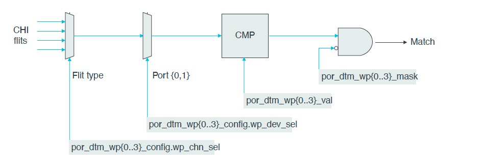

# 倚天710性能监控 —— CMN Flit Traffic Trace with Watchpoint Event

## REVISION HISTORY

| DATE      | VERSION | DESCRIPTION     | AUTHOR    | APPROVER    |
| --------- | ------- | --------------- | --------- | ----------- |
| 2023/2/26 | 1.0     | Initial version | Shuai Xue | Baolin Wang |

## 前言

文章《倚天710性能监控 —— CMN PMU概述》我们介绍了如果使用CMN的PMU事件，统计带宽，但是带宽统计到的是包含了Request，Response，Snoop和Data，本文介绍如何使用watchpoint事件，过滤统计Data，并验证此方法的准确性。

## 1. DTM watchpoint [1]

A DTM has four **WatchPoints (WPs)** that **monitor flit uploads and downloads at XP device ports.**
WPs monitor flits by matching on a subset of flit fields that you **specify using a pair of val and mask**
**registers.** The following figure shows the WP comparator and the registers that control this functionality.



A WP can be configured to monitor flits from **one of two XP device ports** and **one of four CHI channels**:

- Request(REQ)
- Response(RSP)
- Snoop(SNP)
- **Data(DAT)**

por_dtm_wp:

- por_dtm_wp{0..3}_config.wp_dev_sel: select device port
- por_dtm_wp{0..3}_config.wp_chn_sel: select flit channel
- por_dtm_wp{0..3}_val.wp_chn_sel: specify the value for matching
- por_dtm_wp{0..3}_val.wp_chn_sel: specifies the bits that must be masked from the match comparison

In addition, the WP can be configured to do one or more of the following tasks on detecting a flit match:

- Set trace tag bit on the flit.
- Generate flit trace.
- Generate cross trigger to DTC.
- Generate debug trigger to DTC.
- **Increment PMU counters.**

The four DTM WPs are assigned to flit uploads and downloads according to the following groups:

- WP0 and WP1 are assigned to flit uploads.
- WP2 and WP3 are assigned to flit downloads.

On flit upload channels, RN-F or SN-F is the transmitting device and CMN-700 is the receiving device.
On flit download channels, CMN-700 is the transmitting device and RN-F or SN-F is the receiving
device.

Example:

To monitor REQ flits uploaded from RNF2, set up watchpoints (WPs) inside XP connected to RNF2.
The Opcode and Address fields are mapped to the primary and secondary match registers respectively.
Therefore, you must set up two WPs, one to monitor the Opcode and the other to monitor the Address.


To set up these WPs:

```
1. Program WP0 (upload WP) to monitor REQ.Opcode:
    a. Set dtm_wp0_val/mask registers to match on Opcode=ReadShared
    b. Set dtm_wp0_config to:
        a. Select upload device port (wp_dev_sel=RNF2_port).
        b. Select upload device port ({wp_dev_sel2, wp_dev_sel}=RNF2_port).
        c. Select flit channel (wp_chn_sel=REQ)**
        d. Match format group to primary for Opcode match (wp_grp=0)
        e. Set combined mode to gang-up WP0 and WP1 (wp_combine=1)
        f. Enable REQ flit trace packet generation (set wp_pkt_type and wp_pkt_gen=1)
2. Program WP1 (upload WP) to monitor REQ.Address as follows:
    a. Set dtm_wp1_val/mask registers to match on Address=X
    b. Set dtm_wp1_config to:
        a. Select upload device port (wp_dev_sel=RNF2_port).
        b. Select upload device port ({wp_dev_sel2, wp_dev_sel}=RNF2_port).
        c. Select Flit channel (wp_chn_sel=REQ)
        d. Match format group to secondary for Address match (wp_grp=1)
```


## 2. 验证CMN带宽统计准确性原理

我们使用lmbench中bw_mem统计的值作为标准的准确值，与CMN中CCG统计的实验值作为对比，验证CMN带宽统计的准确性。

### 2.1 数据不准问题

根据上一节，我们知道，通过CMN的Watchpoint事件，我们可以过滤DAT Channel，从而解决数据不准问题。

#### 2.1.1 CMN-700 Topology in Yitian SoC

对于D2D的Data带宽，依然需要知道倚天CMN的拓扑结构，指定NodeID，与PMU事件的区别在于，Watchpoint事件指定的为CCG连接XP的NodeID。

```
D2D
nodeid=0x1b0(432), logid=0x1b, type=0x006(XP), (x,y,portid,devid)=(3,6,0,0)
nodeid=0x1b5(437), logid=0x7, type=0x105(CCLA), (x,y,portid,devid)=(3,6,1,1)
nodeid=0x1a8(424), logid=0x17, type=0x006(XP), (x,y,portid,devid)=(3,5,0,0)
nodeid=0x1ad(429), logid=0x6, type=0x105(CCLA), (x,y,portid,devid)=(3,5,1,1)
nodeid=0x1a0(416), logid=0x13, type=0x006(XP), (x,y,portid,devid)=(3,4,0,0)
nodeid=0x1a5(421), logid=0x5, type=0x105(CCLA), (x,y,portid,devid)=(3,4,1,1)
nodeid=0x198(408), logid=0xf, type=0x006(XP), (x,y,portid,devid)=(3,3,0,0)
nodeid=0x19d(413), logid=0x4, type=0x105(CCLA), (x,y,portid,devid)=(3,3,1,1)
```

#### 2.1.2 DAT带宽统计方法

CMN DAT带宽统计方法如下：

```bash
# - XP uploads and downloads on Die 0
# - XP uploads and downloads on Die 1
perf stat \
        -e arm_cmn_0/type=0x7770,eventid=0x0,bynodeid=1,nodeid=0x198,wp_dev_sel=0x1,wp_chn_sel=0x3,wp_grp=0x0,wp_val=0x0,wp_mask=0xFFFFFFFFFFFFFFFF/ \
        -e arm_cmn_0/type=0x7770,eventid=0x0,bynodeid=1,nodeid=0x1A0,wp_dev_sel=0x1,wp_chn_sel=0x3,wp_grp=0x0,wp_val=0x0,wp_mask=0xFFFFFFFFFFFFFFFF/ \
        -e arm_cmn_0/type=0x7770,eventid=0x0,bynodeid=1,nodeid=0x1A8,wp_dev_sel=0x1,wp_chn_sel=0x3,wp_grp=0x0,wp_val=0x0,wp_mask=0xFFFFFFFFFFFFFFFF/ \
        -e arm_cmn_0/type=0x7770,eventid=0x0,bynodeid=1,nodeid=0x1B0,wp_dev_sel=0x1,wp_chn_sel=0x3,wp_grp=0x0,wp_val=0x0,wp_mask=0xFFFFFFFFFFFFFFFF/ \
        -e arm_cmn_0/type=0x7770,eventid=0x2,bynodeid=1,nodeid=0x198,wp_dev_sel=0x1,wp_chn_sel=0x3,wp_grp=0x0,wp_val=0x0,wp_mask=0xFFFFFFFFFFFFFFFF/ \
        -e arm_cmn_0/type=0x7770,eventid=0x2,bynodeid=1,nodeid=0x1A0,wp_dev_sel=0x1,wp_chn_sel=0x3,wp_grp=0x0,wp_val=0x0,wp_mask=0xFFFFFFFFFFFFFFFF/ \
        -e arm_cmn_0/type=0x7770,eventid=0x2,bynodeid=1,nodeid=0x1A8,wp_dev_sel=0x1,wp_chn_sel=0x3,wp_grp=0x0,wp_val=0x0,wp_mask=0xFFFFFFFFFFFFFFFF/ \
        -e arm_cmn_0/type=0x7770,eventid=0x2,bynodeid=1,nodeid=0x1B0,wp_dev_sel=0x1,wp_chn_sel=0x3,wp_grp=0x0,wp_val=0x0,wp_mask=0xFFFFFFFFFFFFFFFF/ \
        -e arm_cmn_1/type=0x7770,eventid=0x0,bynodeid=1,nodeid=0x198,wp_dev_sel=0x1,wp_chn_sel=0x3,wp_grp=0x0,wp_val=0x0,wp_mask=0xFFFFFFFFFFFFFFFF/ \
        -e arm_cmn_1/type=0x7770,eventid=0x0,bynodeid=1,nodeid=0x1A0,wp_dev_sel=0x1,wp_chn_sel=0x3,wp_grp=0x0,wp_val=0x0,wp_mask=0xFFFFFFFFFFFFFFFF/ \
        -e arm_cmn_1/type=0x7770,eventid=0x0,bynodeid=1,nodeid=0x1A8,wp_dev_sel=0x1,wp_chn_sel=0x3,wp_grp=0x0,wp_val=0x0,wp_mask=0xFFFFFFFFFFFFFFFF/ \
        -e arm_cmn_1/type=0x7770,eventid=0x0,bynodeid=1,nodeid=0x1B0,wp_dev_sel=0x1,wp_chn_sel=0x3,wp_grp=0x0,wp_val=0x0,wp_mask=0xFFFFFFFFFFFFFFFF/ \
        -e arm_cmn_1/type=0x7770,eventid=0x2,bynodeid=1,nodeid=0x198,wp_dev_sel=0x1,wp_chn_sel=0x3,wp_grp=0x0,wp_val=0x0,wp_mask=0xFFFFFFFFFFFFFFFF/ \
        -e arm_cmn_1/type=0x7770,eventid=0x2,bynodeid=1,nodeid=0x1A0,wp_dev_sel=0x1,wp_chn_sel=0x3,wp_grp=0x0,wp_val=0x0,wp_mask=0xFFFFFFFFFFFFFFFF/ \
        -e arm_cmn_1/type=0x7770,eventid=0x2,bynodeid=1,nodeid=0x1A8,wp_dev_sel=0x1,wp_chn_sel=0x3,wp_grp=0x0,wp_val=0x0,wp_mask=0xFFFFFFFFFFFFFFFF/ \
        -e arm_cmn_1/type=0x7770,eventid=0x2,bynodeid=1,nodeid=0x1B0,wp_dev_sel=0x1,wp_chn_sel=0x3,wp_grp=0x0,wp_val=0x0,wp_mask=0xFFFFFFFFFFFFFFFF/ \
        -a -- sleep 1
```

- type=0x7770, watchpoint
- eventid: 0x0 for uploads, 0x2 for downloads
- bynodeid=1,nodeid=0x198: specify nodeid of XP which  connects with CCG
- wp_dev_sel:0x1 for CCG
- wp_chn_sel: 0x3 for DATA VC
- wp_grp: 0x0 for primary group (WP 0,2 for primary group, WP 1,3 for secondary group)
- wp_val=0x0: reset value
- wp_mask=0xFFFFFFFFFFFFFFFF: All fields in the primary match group will be ignored so that any upload DAT flit would be a match

WP is selected by eventid + wp_grp, e.g.:

- eventid=0x0, wp_grp=0x0: WP 0 for uploads primary group
- eventid=0x0, wp_grp=0x1: WP 1 for uploads secondary group
- eventid=0x2, wp_grp=0x0: WP 2 for downloads primary group

带宽公式：

- Inter-Socket RX Bandwidth =  Flit_Size _ CCG_WP0_RX_DATA_FLIT _ CMN_Freq / PMU_CYCLE_COUNTER
- Inter-Socket TX Bandwidth =  Flit_Size _ CCG_WP0_TX_DATA_FLIT _ CMN_Freq / PMU_CYCLE_COUNTER
- Inter-Die RX Bandwidth =  Flit_Size _ CCG_WP0_RX_DATA_FLIT _ CMN_Freq / PMU_CYCLE_COUNTER
- Inter-Die TX Bandwidth =  Flit_Size _ CCG_WP0_TX_DATA_FLIT _ CMN_Freq / PMU_CYCLE_COUNTER
- Flit_Size = 32 Bytes

### 2.2 时间不准问题

bw_mem[2]的主要实现逻辑如下：

```bash
benchmp(init_loop, rd, cleanup, 0, parallel,  warmup, repetitions, &state);
    benchmp_child()		// child process
        initialize()		// init buffer
            bzero((void*)state->buf, state->nbytes);
        while (1) {			// run workload `rd`, repeat  repetitions times (default 11)
	         (*benchmark)(benchmp_interval(&_benchmp_child_state), cookie);
                	switch (state->state) {
	                case warmup:
                                //....
	                case timing_interval:
                                // effective value couting by bw_mem, repeat 11 times
	                case cooldown:
                                //...
        }
```

为了更准确的统计计算时间，lmbench中有很多代码逻辑用来统计loop overlead，timing overlead，在计算带宽的有效统计时间时，这些overhead都会被去掉。此外，通过bzero初始化数据buffer也很耗时，40 GB的buffer大概需要15.31秒。因此，在用大的buffer验证带宽时，bw_mem的有效运行时间和程序运行时间会差很大，导致CMN统计的实验值和bw_mem的标准真值有出入。

bw_mem的标准真值，是在初始化以及warmup后，多次运行计算带宽，取的中位数。在未指定运行次数时，重复运行11次。在验证CMN统计带宽准确性时，我们使用如下技巧：

- 修改bw_mem，在`case timing_interval`处增加打印提示
- 测试时后台运行bw_mem
- perf运行时间为1秒，每秒输出带宽值
- 使用perf统计在`case timing_interval`时间统计的带宽值作为实验值

## 3. 带宽验证

### 3.1 TL;DR
| case | command | bw_mem | CCG BW | flits (N0, N1) |
| --- | --- | --- | --- | --- |
| C0M1 rd | numactl --cpubind=0 --membind=1 ./bw_mem 40960M rd | 11520 | 11555 | uploads, downloads |
| C1M0 rd | numactl --cpubind=1 --membind=0 ./bw_mem 40960M rd | 11566 | 11586 | downloads, uploads |
| C0M1 fwr | numactl --cpubind=0 --membind=1 ./bw_mem 40960M fwr | 21936 | 21989 | downloads, uploads |
| C1M0 fwr | numactl --cpubind=1 --membind=0 ./bw_mem 40960M fwr | 21968 | 21930 | uploads, downloads |


- 带宽单位：MB/s

可以看到，通过Watchpoint事件，DAT带宽统计误差不超过 1%。

### 3.2 READ

#### C0M1

```bash
# First, run bw_mem as backgroud workload
# numactl --cpubind=0 --membind=1 ./bw_mem 40960M rd

# Then run perf command in another console
$ perf stat \
        -e arm_cmn_0/type=0x7770,eventid=0x0,bynodeid=1,nodeid=0x198,wp_dev_sel=0x1,wp_chn_sel=0x3,wp_grp=0x0,wp_val=0x0,wp_mask=0xFFFFFFFFFFFFFFFF/ \
        -e arm_cmn_0/type=0x7770,eventid=0x0,bynodeid=1,nodeid=0x1A0,wp_dev_sel=0x1,wp_chn_sel=0x3,wp_grp=0x0,wp_val=0x0,wp_mask=0xFFFFFFFFFFFFFFFF/ \
        -e arm_cmn_0/type=0x7770,eventid=0x0,bynodeid=1,nodeid=0x1A8,wp_dev_sel=0x1,wp_chn_sel=0x3,wp_grp=0x0,wp_val=0x0,wp_mask=0xFFFFFFFFFFFFFFFF/ \
        -e arm_cmn_0/type=0x7770,eventid=0x0,bynodeid=1,nodeid=0x1B0,wp_dev_sel=0x1,wp_chn_sel=0x3,wp_grp=0x0,wp_val=0x0,wp_mask=0xFFFFFFFFFFFFFFFF/ \
        -e arm_cmn_0/type=0x7770,eventid=0x2,bynodeid=1,nodeid=0x198,wp_dev_sel=0x1,wp_chn_sel=0x3,wp_grp=0x0,wp_val=0x0,wp_mask=0xFFFFFFFFFFFFFFFF/ \
        -e arm_cmn_0/type=0x7770,eventid=0x2,bynodeid=1,nodeid=0x1A0,wp_dev_sel=0x1,wp_chn_sel=0x3,wp_grp=0x0,wp_val=0x0,wp_mask=0xFFFFFFFFFFFFFFFF/ \
        -e arm_cmn_0/type=0x7770,eventid=0x2,bynodeid=1,nodeid=0x1A8,wp_dev_sel=0x1,wp_chn_sel=0x3,wp_grp=0x0,wp_val=0x0,wp_mask=0xFFFFFFFFFFFFFFFF/ \
        -e arm_cmn_0/type=0x7770,eventid=0x2,bynodeid=1,nodeid=0x1B0,wp_dev_sel=0x1,wp_chn_sel=0x3,wp_grp=0x0,wp_val=0x0,wp_mask=0xFFFFFFFFFFFFFFFF/ \
        -e arm_cmn_1/type=0x7770,eventid=0x0,bynodeid=1,nodeid=0x198,wp_dev_sel=0x1,wp_chn_sel=0x3,wp_grp=0x0,wp_val=0x0,wp_mask=0xFFFFFFFFFFFFFFFF/ \
        -e arm_cmn_1/type=0x7770,eventid=0x0,bynodeid=1,nodeid=0x1A0,wp_dev_sel=0x1,wp_chn_sel=0x3,wp_grp=0x0,wp_val=0x0,wp_mask=0xFFFFFFFFFFFFFFFF/ \
        -e arm_cmn_1/type=0x7770,eventid=0x0,bynodeid=1,nodeid=0x1A8,wp_dev_sel=0x1,wp_chn_sel=0x3,wp_grp=0x0,wp_val=0x0,wp_mask=0xFFFFFFFFFFFFFFFF/ \
        -e arm_cmn_1/type=0x7770,eventid=0x0,bynodeid=1,nodeid=0x1B0,wp_dev_sel=0x1,wp_chn_sel=0x3,wp_grp=0x0,wp_val=0x0,wp_mask=0xFFFFFFFFFFFFFFFF/ \
        -e arm_cmn_1/type=0x7770,eventid=0x2,bynodeid=1,nodeid=0x198,wp_dev_sel=0x1,wp_chn_sel=0x3,wp_grp=0x0,wp_val=0x0,wp_mask=0xFFFFFFFFFFFFFFFF/ \
        -e arm_cmn_1/type=0x7770,eventid=0x2,bynodeid=1,nodeid=0x1A0,wp_dev_sel=0x1,wp_chn_sel=0x3,wp_grp=0x0,wp_val=0x0,wp_mask=0xFFFFFFFFFFFFFFFF/ \
        -e arm_cmn_1/type=0x7770,eventid=0x2,bynodeid=1,nodeid=0x1A8,wp_dev_sel=0x1,wp_chn_sel=0x3,wp_grp=0x0,wp_val=0x0,wp_mask=0xFFFFFFFFFFFFFFFF/ \
        -e arm_cmn_1/type=0x7770,eventid=0x2,bynodeid=1,nodeid=0x1B0,wp_dev_sel=0x1,wp_chn_sel=0x3,wp_grp=0x0,wp_val=0x0,wp_mask=0xFFFFFFFFFFFFFFFF/ \
        -a -- sleep 1

          90278067      arm_cmn_0/type=0x7770,eventid=0x0,bynodeid=1,nodeid=0x198,wp_dev_sel=0x1,wp_chn_sel=0x3,wp_grp=0x0,wp_val=0x0,wp_mask=0xFFFFFFFFFFFFFFFF/
          90278600      arm_cmn_0/type=0x7770,eventid=0x0,bynodeid=1,nodeid=0x1A0,wp_dev_sel=0x1,wp_chn_sel=0x3,wp_grp=0x0,wpval=0x0,wp_mask=0xFFFFFFFFFFFFFFFF/
          90277969      arm_cmn_0/type=0x7770,eventid=0x0,bynodeid=1,nodeid=0x1A8,wp_dev_sel=0x1,wp_chn_sel=0x3,wp_grp=0x0,wp_val=0x0,wp_mask=0xFFFFFFFFFFFFFFFF/
          90278284      arm_cmn_0/type=0x7770,eventid=0x0,bynodeid=1,nodeid=0x1B0,wp_dev_sel=0x1,wp_chn_sel=0x3,wp_grp=0x0,wp_val=0x0,wp_mask=0xFFFFFFFFFFFFFFFF/
           3611734      arm_cmn_0/type=0x7770,eventid=0x2,bynodeid=1,nodeid=0x198,wp_dev_sel=0x1,wp_chn_sel=0x3,wp_grp=0x0,wp_val=0x0,wp_mask=0xFFFFFFFFFFFFFFFF/
           3597502      arm_cmn_0/type=0x7770,eventid=0x2,bynodeid=1,nodeid=0x1A0,wp_dev_sel=0x1,wp_chn_sel=0x3,wp_grp=0x0,wp_val=0x0,wp_mask=0xFFFFFFFFFFFFFFFF/
           3727456      arm_cmn_0/type=0x7770,eventid=0x2,bynodeid=1,nodeid=0x1A8,wp_dev_sel=0x1,wp_chn_sel=0x3,wp_grp=0x0,wp_val=0x0,wp_mask=0xFFFFFFFFFFFFFFFF/
           3553791      arm_cmn_0/type=0x7770,eventid=0x2,bynodeid=1,nodeid=0x1B0,wp_dev_sel=0x1,wp_chn_sel=0x3,wp_grp=0x0,wp_val=0x0,wp_mask=0xFFFFFFFFFFFFFFFF/
           3554765      arm_cmn_1/type=0x7770,eventid=0x0,bynodeid=1,nodeid=0x198,wp_dev_sel=0x1,wp_chn_sel=0x3,wp_grp=0x0,wp_val=0x0,wp_mask=0xFFFFFFFFFFFFFFFF/
           3728825      arm_cmn_1/type=0x7770,eventid=0x0,bynodeid=1,nodeid=0x1A0,wp_dev_sel=0x1,wp_chn_sel=0x3,wp_grp=0x0,wp_val=0x0,wp_mask=0xFFFFFFFFFFFFFFFF/
           3598923      arm_cmn_1/type=0x7770,eventid=0x0,bynodeid=1,nodeid=0x1A8,wp_dev_sel=0x1,wp_chn_sel=0x3,wp_grp=0x0,wp_val=0x0,wp_mask=0xFFFFFFFFFFFFFFFF/
           3613123      arm_cmn_1/type=0x7770,eventid=0x0,bynodeid=1,nodeid=0x1B0,wp_dev_sel=0x1,wp_chn_sel=0x3,wp_grp=0x0,wp_val=0x0,wp_mask=0xFFFFFFFFFFFFFFFF/
          90276087      arm_cmn_1/type=0x7770,eventid=0x2,bynodeid=1,nodeid=0x198,wp_dev_sel=0x1,wp_chn_sel=0x3,wp_grp=0x0,wp_val=0x0,wp_mask=0xFFFFFFFFFFFFFFFF/
          90276563      arm_cmn_1/type=0x7770,eventid=0x2,bynodeid=1,nodeid=0x1A0,wp_dev_sel=0x1,wp_chn_sel=0x3,wp_grp=0x0,wp_val=0x0,wp_mask=0xFFFFFFFFFFFFFFFF/
          90277616      arm_cmn_1/type=0x7770,eventid=0x2,bynodeid=1,nodeid=0x1A8,wp_dev_sel=0x1,wp_chn_sel=0x3,wp_grp=0x0,wp_val=0x0,wp_mask=0xFFFFFFFFFFFFFFFF/
          90278781      arm_cmn_1/type=0x7770,eventid=0x2,bynodeid=1,nodeid=0x1B0,wp_dev_sel=0x1,wp_chn_sel=0x3,wp_grp=0x0,wp_val=0x0,wp_mask=0xFFFFFFFFFFFFFFFF/


       1.000867931 seconds time elapsed      
       
>>> 90278781*4*32/1000/1000
11555

# node1: memory upload to XP，CCG download from XP
# node0: CCG upload to XP, cpu node 0 download from XP to read
numactl --cpubind=0 --membind=1 ./bw_mem 40960M rd
40960.00 11520.56
```

- upload WP：die0在向die1读取数据，die0的CCG拿到数据后，需要把数据upload到XP上，最终到请求者结束，所以die0是flit uploads
- download WP：die0在向die1读取数据，die1的XP拿到数据后，CCG需要把数据从XP上download，最终到请求者结束，所以die1是flit downloads.

#### C1M0

```bash
# First, run bw_mem as backgroud workload
# numactl --cpubind=1 --membind=0 ./bw_mem 40960M rd

# Then run perf command in another console
$ perf stat \
        -e arm_cmn_0/type=0x7770,eventid=0x0,bynodeid=1,nodeid=0x198,wp_dev_sel=0x1,wp_chn_sel=0x3,wp_grp=0x0,wp_val=0x0,wp_mask=0xFFFFFFFFFFFFFFFF/ \
        -e arm_cmn_0/type=0x7770,eventid=0x0,bynodeid=1,nodeid=0x1A0,wp_dev_sel=0x1,wp_chn_sel=0x3,wp_grp=0x0,wp_val=0x0,wp_mask=0xFFFFFFFFFFFFFFFF/ \
        -e arm_cmn_0/type=0x7770,eventid=0x0,bynodeid=1,nodeid=0x1A8,wp_dev_sel=0x1,wp_chn_sel=0x3,wp_grp=0x0,wp_val=0x0,wp_mask=0xFFFFFFFFFFFFFFFF/ \
        -e arm_cmn_0/type=0x7770,eventid=0x0,bynodeid=1,nodeid=0x1B0,wp_dev_sel=0x1,wp_chn_sel=0x3,wp_grp=0x0,wp_val=0x0,wp_mask=0xFFFFFFFFFFFFFFFF/ \
        -e arm_cmn_0/type=0x7770,eventid=0x2,bynodeid=1,nodeid=0x198,wp_dev_sel=0x1,wp_chn_sel=0x3,wp_grp=0x0,wp_val=0x0,wp_mask=0xFFFFFFFFFFFFFFFF/ \
        -e arm_cmn_0/type=0x7770,eventid=0x2,bynodeid=1,nodeid=0x1A0,wp_dev_sel=0x1,wp_chn_sel=0x3,wp_grp=0x0,wp_val=0x0,wp_mask=0xFFFFFFFFFFFFFFFF/ \
        -e arm_cmn_0/type=0x7770,eventid=0x2,bynodeid=1,nodeid=0x1A8,wp_dev_sel=0x1,wp_chn_sel=0x3,wp_grp=0x0,wp_val=0x0,wp_mask=0xFFFFFFFFFFFFFFFF/ \
        -e arm_cmn_0/type=0x7770,eventid=0x2,bynodeid=1,nodeid=0x1B0,wp_dev_sel=0x1,wp_chn_sel=0x3,wp_grp=0x0,wp_val=0x0,wp_mask=0xFFFFFFFFFFFFFFFF/ \
        -e arm_cmn_1/type=0x7770,eventid=0x0,bynodeid=1,nodeid=0x198,wp_dev_sel=0x1,wp_chn_sel=0x3,wp_grp=0x0,wp_val=0x0,wp_mask=0xFFFFFFFFFFFFFFFF/ \
        -e arm_cmn_1/type=0x7770,eventid=0x0,bynodeid=1,nodeid=0x1A0,wp_dev_sel=0x1,wp_chn_sel=0x3,wp_grp=0x0,wp_val=0x0,wp_mask=0xFFFFFFFFFFFFFFFF/ \
        -e arm_cmn_1/type=0x7770,eventid=0x0,bynodeid=1,nodeid=0x1A8,wp_dev_sel=0x1,wp_chn_sel=0x3,wp_grp=0x0,wp_val=0x0,wp_mask=0xFFFFFFFFFFFFFFFF/ \
        -e arm_cmn_1/type=0x7770,eventid=0x0,bynodeid=1,nodeid=0x1B0,wp_dev_sel=0x1,wp_chn_sel=0x3,wp_grp=0x0,wp_val=0x0,wp_mask=0xFFFFFFFFFFFFFFFF/ \
        -e arm_cmn_1/type=0x7770,eventid=0x2,bynodeid=1,nodeid=0x198,wp_dev_sel=0x1,wp_chn_sel=0x3,wp_grp=0x0,wp_val=0x0,wp_mask=0xFFFFFFFFFFFFFFFF/ \
        -e arm_cmn_1/type=0x7770,eventid=0x2,bynodeid=1,nodeid=0x1A0,wp_dev_sel=0x1,wp_chn_sel=0x3,wp_grp=0x0,wp_val=0x0,wp_mask=0xFFFFFFFFFFFFFFFF/ \
        -e arm_cmn_1/type=0x7770,eventid=0x2,bynodeid=1,nodeid=0x1A8,wp_dev_sel=0x1,wp_chn_sel=0x3,wp_grp=0x0,wp_val=0x0,wp_mask=0xFFFFFFFFFFFFFFFF/ \
        -e arm_cmn_1/type=0x7770,eventid=0x2,bynodeid=1,nodeid=0x1B0,wp_dev_sel=0x1,wp_chn_sel=0x3,wp_grp=0x0,wp_val=0x0,wp_mask=0xFFFFFFFFFFFFFFFF/ \
        -a -- sleep 1
        
Performance counter stats for 'system wide':

           3419746      arm_cmn_0/type=0x7770,eventid=0x0,bynodeid=1,nodeid=0x198,wp_dev_sel=0x1,wp_chn_sel=0x3,wp_grp=0x0,wp_val=0x0,wp_mask=0xFFFFFFFFFFFFFFFF/
           3467562      arm_cmn_0/type=0x7770,eventid=0x0,bynodeid=1,nodeid=0x1A0,wp_dev_sel=0x1,wp_chn_sel=0x3,wp_grp=0x0,wp_val=0x0,wp_mask=0xFFFFFFFFFFFFFFFF/
           3403892      arm_cmn_0/type=0x7770,eventid=0x0,bynodeid=1,nodeid=0x1A8,wp_dev_sel=0x1,wp_chn_sel=0x3,wp_grp=0x0,wp_val=0x0,wp_mask=0xFFFFFFFFFFFFFFFF/
           3457318      arm_cmn_0/type=0x7770,eventid=0x0,bynodeid=1,nodeid=0x1B0,wp_dev_sel=0x1,wp_chn_sel=0x3,wp_grp=0x0,wp_val=0x0,wp_mask=0xFFFFFFFFFFFFFFFF/
          90469072      arm_cmn_0/type=0x7770,eventid=0x2,bynodeid=1,nodeid=0x198,wp_dev_sel=0x1,wp_chn_sel=0x3,wp_grp=0x0,wp_val=0x0,wp_mask=0xFFFFFFFFFFFFFFFF/
          90517461      arm_cmn_0/type=0x7770,eventid=0x2,bynodeid=1,nodeid=0x1A0,wp_dev_sel=0x1,wp_chn_sel=0x3,wp_grp=0x0,wp_val=0x0,wp_mask=0xFFFFFFFFFFFFFFFF/
          90570438      arm_cmn_0/type=0x7770,eventid=0x2,bynodeid=1,nodeid=0x1A8,wp_dev_sel=0x1,wp_chn_sel=0x3,wp_grp=0x0,wp_val=0x0,wp_mask=0xFFFFFFFFFFFFFFFF/
          90459938      arm_cmn_0/type=0x7770,eventid=0x2,bynodeid=1,nodeid=0x1B0,wp_dev_sel=0x1,wp_chn_sel=0x3,wp_grp=0x0,wp_val=0x0,wp_mask=0xFFFFFFFFFFFFFFFF/
          90456309      arm_cmn_1/type=0x7770,eventid=0x0,bynodeid=1,nodeid=0x198,wp_dev_sel=0x1,wp_chn_sel=0x3,wp_grp=0x0,wp_val=0x0,wp_mask=0xFFFFFFFFFFFFFFFF/
          90567238      arm_cmn_1/type=0x7770,eventid=0x0,bynodeid=1,nodeid=0x1A0,wp_dev_sel=0x1,wp_chn_sel=0x3,wp_grp=0x0,wp_val=0x0,wp_mask=0xFFFFFFFFFFFFFFFF/
          90514305      arm_cmn_1/type=0x7770,eventid=0x0,bynodeid=1,nodeid=0x1A8,wp_dev_sel=0x1,wp_chn_sel=0x3,wp_grp=0x0,wp_val=0x0,wp_mask=0xFFFFFFFFFFFFFFFF/
          90466295      arm_cmn_1/type=0x7770,eventid=0x0,bynodeid=1,nodeid=0x1B0,wp_dev_sel=0x1,wp_chn_sel=0x3,wp_grp=0x0,wp_val=0x0,wp_mask=0xFFFFFFFFFFFFFFFF/
           3456776      arm_cmn_1/type=0x7770,eventid=0x2,bynodeid=1,nodeid=0x198,wp_dev_sel=0x1,wp_chn_sel=0x3,wp_grp=0x0,wp_val=0x0,wp_mask=0xFFFFFFFFFFFFFFFF/
           3403490      arm_cmn_1/type=0x7770,eventid=0x2,bynodeid=1,nodeid=0x1A0,wp_dev_sel=0x1,wp_chn_sel=0x3,wp_grp=0x0,wp_val=0x0,wp_mask=0xFFFFFFFFFFFFFFFF/
           3467108      arm_cmn_1/type=0x7770,eventid=0x2,bynodeid=1,nodeid=0x1A8,wp_dev_sel=0x1,wp_chn_sel=0x3,wp_grp=0x0,wp_val=0x0,wp_mask=0xFFFFFFFFFFFFFFFF/
           3419442      arm_cmn_1/type=0x7770,eventid=0x2,bynodeid=1,nodeid=0x1B0,wp_dev_sel=0x1,wp_chn_sel=0x3,wp_grp=0x0,wp_val=0x0,wp_mask=0xFFFFFFFFFFFFFFFF/

       1.000748035 seconds time elapsed
       
$ numactl --cpubind=1 --membind=0 ./bw_mem 40960M rd
40960.00 11566.47

>>> 90517461*4*32/1000/1000
11586
```


### 3.3 WRITE

```bash
# First, run bw_mem as backgroud workload
# numactl --cpubind=1 --membind=0 ./bw_mem 40960M wr

# Then run perf command in another console
perf stat \
        -e arm_cmn_0/type=0x7770,eventid=0x0,bynodeid=1,nodeid=0x198,wp_dev_sel=0x1,wp_chn_sel=0x3,wp_grp=0x0,wp_val=0x0,wp_mask=0xFFFFFFFFFFFFFFFF/ \
        -e arm_cmn_0/type=0x7770,eventid=0x0,bynodeid=1,nodeid=0x1A0,wp_dev_sel=0x1,wp_chn_sel=0x3,wp_grp=0x0,wp_val=0x0,wp_mask=0xFFFFFFFFFFFFFFFF/ \
        -e arm_cmn_0/type=0x7770,eventid=0x0,bynodeid=1,nodeid=0x1A8,wp_dev_sel=0x1,wp_chn_sel=0x3,wp_grp=0x0,wp_val=0x0,wp_mask=0xFFFFFFFFFFFFFFFF/ \
        -e arm_cmn_0/type=0x7770,eventid=0x0,bynodeid=1,nodeid=0x1B0,wp_dev_sel=0x1,wp_chn_sel=0x3,wp_grp=0x0,wp_val=0x0,wp_mask=0xFFFFFFFFFFFFFFFF/ \
        -e arm_cmn_0/type=0x7770,eventid=0x2,bynodeid=1,nodeid=0x198,wp_dev_sel=0x1,wp_chn_sel=0x3,wp_grp=0x0,wp_val=0x0,wp_mask=0xFFFFFFFFFFFFFFFF/ \
        -e arm_cmn_0/type=0x7770,eventid=0x2,bynodeid=1,nodeid=0x1A0,wp_dev_sel=0x1,wp_chn_sel=0x3,wp_grp=0x0,wp_val=0x0,wp_mask=0xFFFFFFFFFFFFFFFF/ \
        -e arm_cmn_0/type=0x7770,eventid=0x2,bynodeid=1,nodeid=0x1A8,wp_dev_sel=0x1,wp_chn_sel=0x3,wp_grp=0x0,wp_val=0x0,wp_mask=0xFFFFFFFFFFFFFFFF/ \
        -e arm_cmn_0/type=0x7770,eventid=0x2,bynodeid=1,nodeid=0x1B0,wp_dev_sel=0x1,wp_chn_sel=0x3,wp_grp=0x0,wp_val=0x0,wp_mask=0xFFFFFFFFFFFFFFFF/ \
        -e arm_cmn_1/type=0x7770,eventid=0x0,bynodeid=1,nodeid=0x198,wp_dev_sel=0x1,wp_chn_sel=0x3,wp_grp=0x0,wp_val=0x0,wp_mask=0xFFFFFFFFFFFFFFFF/ \
        -e arm_cmn_1/type=0x7770,eventid=0x0,bynodeid=1,nodeid=0x1A0,wp_dev_sel=0x1,wp_chn_sel=0x3,wp_grp=0x0,wp_val=0x0,wp_mask=0xFFFFFFFFFFFFFFFF/ \
        -e arm_cmn_1/type=0x7770,eventid=0x0,bynodeid=1,nodeid=0x1A8,wp_dev_sel=0x1,wp_chn_sel=0x3,wp_grp=0x0,wp_val=0x0,wp_mask=0xFFFFFFFFFFFFFFFF/ \
        -e arm_cmn_1/type=0x7770,eventid=0x0,bynodeid=1,nodeid=0x1B0,wp_dev_sel=0x1,wp_chn_sel=0x3,wp_grp=0x0,wp_val=0x0,wp_mask=0xFFFFFFFFFFFFFFFF/ \
        -e arm_cmn_1/type=0x7770,eventid=0x2,bynodeid=1,nodeid=0x198,wp_dev_sel=0x1,wp_chn_sel=0x3,wp_grp=0x0,wp_val=0x0,wp_mask=0xFFFFFFFFFFFFFFFF/ \
        -e arm_cmn_1/type=0x7770,eventid=0x2,bynodeid=1,nodeid=0x1A0,wp_dev_sel=0x1,wp_chn_sel=0x3,wp_grp=0x0,wp_val=0x0,wp_mask=0xFFFFFFFFFFFFFFFF/ \
        -e arm_cmn_1/type=0x7770,eventid=0x2,bynodeid=1,nodeid=0x1A8,wp_dev_sel=0x1,wp_chn_sel=0x3,wp_grp=0x0,wp_val=0x0,wp_mask=0xFFFFFFFFFFFFFFFF/ \
        -e arm_cmn_1/type=0x7770,eventid=0x2,bynodeid=1,nodeid=0x1B0,wp_dev_sel=0x1,wp_chn_sel=0x3,wp_grp=0x0,wp_val=0x0,wp_mask=0xFFFFFFFFFFFFFFFF/ \
        -a -- sleep 1
 
 Performance counter stats for 'system wide':

          49920378      arm_cmn_0/type=0x7770,eventid=0x0,bynodeid=1,nodeid=0x198,wp_dev_sel=0x1,wp_chn_sel=0x3,wp_grp=0x0,wp_val=0x0,wp_mask=0xFFFFFFFFFFFFFFFF/
          49919382      arm_cmn_0/type=0x7770,eventid=0x0,bynodeid=1,nodeid=0x1A0,wp_dev_sel=0x1,wp_chn_sel=0x3,wp_grp=0x0,wp_val=0x0,wp_mask=0xFFFFFFFFFFFFFFFF/
          49920459      arm_cmn_0/type=0x7770,eventid=0x0,bynodeid=1,nodeid=0x1A8,wp_dev_sel=0x1,wp_chn_sel=0x3,wp_grp=0x0,wp_val=0x0,wp_mask=0xFFFFFFFFFFFFFFFF/
          49919681      arm_cmn_0/type=0x7770,eventid=0x0,bynodeid=1,nodeid=0x1B0,wp_dev_sel=0x1,wp_chn_sel=0x3,wp_grp=0x0,wp_val=0x0,wp_mask=0xFFFFFFFFFFFFFFFF/
          49895686      arm_cmn_0/type=0x7770,eventid=0x2,bynodeid=1,nodeid=0x198,wp_dev_sel=0x1,wp_chn_sel=0x3,wp_grp=0x0,wp_val=0x0,wp_mask=0xFFFFFFFFFFFFFFFF/
          49943796      arm_cmn_0/type=0x7770,eventid=0x2,bynodeid=1,nodeid=0x1A0,wp_dev_sel=0x1,wp_chn_sel=0x3,wp_grp=0x0,wp_val=0x0,wp_mask=0xFFFFFFFFFFFFFFFF/
          50004151      arm_cmn_0/type=0x7770,eventid=0x2,bynodeid=1,nodeid=0x1A8,wp_dev_sel=0x1,wp_chn_sel=0x3,wp_grp=0x0,wp_val=0x0,wp_mask=0xFFFFFFFFFFFFFFFF/
          49887332      arm_cmn_0/type=0x7770,eventid=0x2,bynodeid=1,nodeid=0x1B0,wp_dev_sel=0x1,wp_chn_sel=0x3,wp_grp=0x0,wp_val=0x0,wp_mask=0xFFFFFFFFFFFFFFFF/
          49885729      arm_cmn_1/type=0x7770,eventid=0x0,bynodeid=1,nodeid=0x198,wp_dev_sel=0x1,wp_chn_sel=0x3,wp_grp=0x0,wp_val=0x0,wp_mask=0xFFFFFFFFFFFFFFFF/
          50002696      arm_cmn_1/type=0x7770,eventid=0x0,bynodeid=1,nodeid=0x1A0,wp_dev_sel=0x1,wp_chn_sel=0x3,wp_grp=0x0,wp_val=0x0,wp_mask=0xFFFFFFFFFFFFFFFF/
          49942498      arm_cmn_1/type=0x7770,eventid=0x0,bynodeid=1,nodeid=0x1A8,wp_dev_sel=0x1,wp_chn_sel=0x3,wp_grp=0x0,wp_val=0x0,wp_mask=0xFFFFFFFFFFFFFFFF/
          49894579      arm_cmn_1/type=0x7770,eventid=0x0,bynodeid=1,nodeid=0x1B0,wp_dev_sel=0x1,wp_chn_sel=0x3,wp_grp=0x0,wp_val=0x0,wp_mask=0xFFFFFFFFFFFFFFFF/
          49917633      arm_cmn_1/type=0x7770,eventid=0x2,bynodeid=1,nodeid=0x198,wp_dev_sel=0x1,wp_chn_sel=0x3,wp_grp=0x0,wp_val=0x0,wp_mask=0xFFFFFFFFFFFFFFFF/
          49918928      arm_cmn_1/type=0x7770,eventid=0x2,bynodeid=1,nodeid=0x1A0,wp_dev_sel=0x1,wp_chn_sel=0x3,wp_grp=0x0,wp_val=0x0,wp_mask=0xFFFFFFFFFFFFFFFF/
          49918235      arm_cmn_1/type=0x7770,eventid=0x2,bynodeid=1,nodeid=0x1A8,wp_dev_sel=0x1,wp_chn_sel=0x3,wp_grp=0x0,wp_val=0x0,wp_mask=0xFFFFFFFFFFFFFFFF/
          49920091      arm_cmn_1/type=0x7770,eventid=0x2,bynodeid=1,nodeid=0x1B0,wp_dev_sel=0x1,wp_chn_sel=0x3,wp_grp=0x0,wp_val=0x0,wp_mask=0xFFFFFFFFFFFFFFFF/


       1.000911250 seconds time elapsed

>>> 50099224*4*32/1000/1000
6389

numactl --cpubind=0 --membind=1 ./bw_mem 40960M wr
40960.00 6373.56
```

- fwr: write every 4 byte word
- wr: 4 byte write, 32 byte stride

> When in write streaming mode, load operations behave as normal, and can still cause linefills.
Writes still lookup in the cache, but if they miss then they write out to the L2 or L3 cache rather
than starting a linefill. [2]


wr为每写4字节，间隔32字节。cacheline大小为64字节，每次write miss，都会导致cacheline-fill（write allocation），因此，wr都是会有读带宽和写带宽。fwr为连续写4字节，会触发N2处理器的write streaming mode，写穿cache，因此，fwr只有写带宽，没有读带宽。

#### C0M1

```bash
# First, run bw_mem as backgroud workload
# numactl --cpubind=0 --membind=1 ./bw_mem 40960M fwr

# Then run perf command in another console
perf stat \
        -e arm_cmn_0/type=0x7770,eventid=0x0,bynodeid=1,nodeid=0x198,wp_dev_sel=0x1,wp_chn_sel=0x3,wp_grp=0x0,wp_val=0x0,wp_mask=0xFFFFFFFFFFFFFFFF/ \
        -e arm_cmn_0/type=0x7770,eventid=0x0,bynodeid=1,nodeid=0x1A0,wp_dev_sel=0x1,wp_chn_sel=0x3,wp_grp=0x0,wp_val=0x0,wp_mask=0xFFFFFFFFFFFFFFFF/ \
        -e arm_cmn_0/type=0x7770,eventid=0x0,bynodeid=1,nodeid=0x1A8,wp_dev_sel=0x1,wp_chn_sel=0x3,wp_grp=0x0,wp_val=0x0,wp_mask=0xFFFFFFFFFFFFFFFF/ \
        -e arm_cmn_0/type=0x7770,eventid=0x0,bynodeid=1,nodeid=0x1B0,wp_dev_sel=0x1,wp_chn_sel=0x3,wp_grp=0x0,wp_val=0x0,wp_mask=0xFFFFFFFFFFFFFFFF/ \
        -e arm_cmn_0/type=0x7770,eventid=0x2,bynodeid=1,nodeid=0x198,wp_dev_sel=0x1,wp_chn_sel=0x3,wp_grp=0x0,wp_val=0x0,wp_mask=0xFFFFFFFFFFFFFFFF/ \
        -e arm_cmn_0/type=0x7770,eventid=0x2,bynodeid=1,nodeid=0x1A0,wp_dev_sel=0x1,wp_chn_sel=0x3,wp_grp=0x0,wp_val=0x0,wp_mask=0xFFFFFFFFFFFFFFFF/ \
        -e arm_cmn_0/type=0x7770,eventid=0x2,bynodeid=1,nodeid=0x1A8,wp_dev_sel=0x1,wp_chn_sel=0x3,wp_grp=0x0,wp_val=0x0,wp_mask=0xFFFFFFFFFFFFFFFF/ \
        -e arm_cmn_0/type=0x7770,eventid=0x2,bynodeid=1,nodeid=0x1B0,wp_dev_sel=0x1,wp_chn_sel=0x3,wp_grp=0x0,wp_val=0x0,wp_mask=0xFFFFFFFFFFFFFFFF/ \
        -e arm_cmn_1/type=0x7770,eventid=0x0,bynodeid=1,nodeid=0x198,wp_dev_sel=0x1,wp_chn_sel=0x3,wp_grp=0x0,wp_val=0x0,wp_mask=0xFFFFFFFFFFFFFFFF/ \
        -e arm_cmn_1/type=0x7770,eventid=0x0,bynodeid=1,nodeid=0x1A0,wp_dev_sel=0x1,wp_chn_sel=0x3,wp_grp=0x0,wp_val=0x0,wp_mask=0xFFFFFFFFFFFFFFFF/ \
        -e arm_cmn_1/type=0x7770,eventid=0x0,bynodeid=1,nodeid=0x1A8,wp_dev_sel=0x1,wp_chn_sel=0x3,wp_grp=0x0,wp_val=0x0,wp_mask=0xFFFFFFFFFFFFFFFF/ \
        -e arm_cmn_1/type=0x7770,eventid=0x0,bynodeid=1,nodeid=0x1B0,wp_dev_sel=0x1,wp_chn_sel=0x3,wp_grp=0x0,wp_val=0x0,wp_mask=0xFFFFFFFFFFFFFFFF/ \
        -e arm_cmn_1/type=0x7770,eventid=0x2,bynodeid=1,nodeid=0x198,wp_dev_sel=0x1,wp_chn_sel=0x3,wp_grp=0x0,wp_val=0x0,wp_mask=0xFFFFFFFFFFFFFFFF/ \
        -e arm_cmn_1/type=0x7770,eventid=0x2,bynodeid=1,nodeid=0x1A0,wp_dev_sel=0x1,wp_chn_sel=0x3,wp_grp=0x0,wp_val=0x0,wp_mask=0xFFFFFFFFFFFFFFFF/ \
        -e arm_cmn_1/type=0x7770,eventid=0x2,bynodeid=1,nodeid=0x1A8,wp_dev_sel=0x1,wp_chn_sel=0x3,wp_grp=0x0,wp_val=0x0,wp_mask=0xFFFFFFFFFFFFFFFF/ \
        -e arm_cmn_1/type=0x7770,eventid=0x2,bynodeid=1,nodeid=0x1B0,wp_dev_sel=0x1,wp_chn_sel=0x3,wp_grp=0x0,wp_val=0x0,wp_mask=0xFFFFFFFFFFFFFFFF/ \
        -a -- sleep 1
 
 Performance counter stats for 'system wide':

             99569      arm_cmn_0/type=0x7770,eventid=0x0,bynodeid=1,nodeid=0x198,wp_dev_sel=0x1,wp_chn_sel=0x3,wp_grp=0x0,wp_val=0x0,wp_mask=0xFFFFFFFFFFFFFFFF/
             97711      arm_cmn_0/type=0x7770,eventid=0x0,bynodeid=1,nodeid=0x1A0,wp_dev_sel=0x1,wp_chn_sel=0x3,wp_grp=0x0,wp_val=0x0,wp_mask=0xFFFFFFFFFFFFFFFF/
             98130      arm_cmn_0/type=0x7770,eventid=0x0,bynodeid=1,nodeid=0x1A8,wp_dev_sel=0x1,wp_chn_sel=0x3,wp_grp=0x0,wp_val=0x0,wp_mask=0xFFFFFFFFFFFFFFFF/
             97544      arm_cmn_0/type=0x7770,eventid=0x0,bynodeid=1,nodeid=0x1B0,wp_dev_sel=0x1,wp_chn_sel=0x3,wp_grp=0x0,wp_val=0x0,wp_mask=0xFFFFFFFFFFFFFFFF/
         171790464      arm_cmn_0/type=0x7770,eventid=0x2,bynodeid=1,nodeid=0x198,wp_dev_sel=0x1,wp_chn_sel=0x3,wp_grp=0x0,wp_val=0x0,wp_mask=0xFFFFFFFFFFFFFFFF/
         171838050      arm_cmn_0/type=0x7770,eventid=0x2,bynodeid=1,nodeid=0x1A0,wp_dev_sel=0x1,wp_chn_sel=0x3,wp_grp=0x0,wp_val=0x0,wp_mask=0xFFFFFFFFFFFFFFFF/
         171896982      arm_cmn_0/type=0x7770,eventid=0x2,bynodeid=1,nodeid=0x1A8,wp_dev_sel=0x1,wp_chn_sel=0x3,wp_grp=0x0,wp_val=0x0,wp_mask=0xFFFFFFFFFFFFFFFF/
         171781045      arm_cmn_0/type=0x7770,eventid=0x2,bynodeid=1,nodeid=0x1B0,wp_dev_sel=0x1,wp_chn_sel=0x3,wp_grp=0x0,wp_val=0x0,wp_mask=0xFFFFFFFFFFFFFFFF/
         171774934      arm_cmn_1/type=0x7770,eventid=0x0,bynodeid=1,nodeid=0x198,wp_dev_sel=0x1,wp_chn_sel=0x3,wp_grp=0x0,wp_val=0x0,wp_mask=0xFFFFFFFFFFFFFFFF/
         171891867      arm_cmn_1/type=0x7770,eventid=0x0,bynodeid=1,nodeid=0x1A0,wp_dev_sel=0x1,wp_chn_sel=0x3,wp_grp=0x0,wp_val=0x0,wp_mask=0xFFFFFFFFFFFFFFFF/
         171833314      arm_cmn_1/type=0x7770,eventid=0x0,bynodeid=1,nodeid=0x1A8,wp_dev_sel=0x1,wp_chn_sel=0x3,wp_grp=0x0,wp_val=0x0,wp_mask=0xFFFFFFFFFFFFFFFF/
         171786692      arm_cmn_1/type=0x7770,eventid=0x0,bynodeid=1,nodeid=0x1B0,wp_dev_sel=0x1,wp_chn_sel=0x3,wp_grp=0x0,wp_val=0x0,wp_mask=0xFFFFFFFFFFFFFFFF/
             96434      arm_cmn_1/type=0x7770,eventid=0x2,bynodeid=1,nodeid=0x198,wp_dev_sel=0x1,wp_chn_sel=0x3,wp_grp=0x0,wp_val=0x0,wp_mask=0xFFFFFFFFFFFFFFFF/
             97152      arm_cmn_1/type=0x7770,eventid=0x2,bynodeid=1,nodeid=0x1A0,wp_dev_sel=0x1,wp_chn_sel=0x3,wp_grp=0x0,wp_val=0x0,wp_mask=0xFFFFFFFFFFFFFFFF/
             96733      arm_cmn_1/type=0x7770,eventid=0x2,bynodeid=1,nodeid=0x1A8,wp_dev_sel=0x1,wp_chn_sel=0x3,wp_grp=0x0,wp_val=0x0,wp_mask=0xFFFFFFFFFFFFFFFF/
             98713      arm_cmn_1/type=0x7770,eventid=0x2,bynodeid=1,nodeid=0x1B0,wp_dev_sel=0x1,wp_chn_sel=0x3,wp_grp=0x0,wp_val=0x0,wp_mask=0xFFFFFFFFFFFFFFFF/

       1.000987867 seconds time elapsed

>>> 171790464*4*32/1000/1000
21989

# node0: cpu node 0 write to XP, CCG download from XP, 
# node1: CCG upload to XP, XP to memnode 1
# 
numactl --cpubind=0 --membind=1 ./bw_mem 40960M fwr
40960.00 21936.82
```

#### C1M0

```bash
# First, run bw_mem as backgroud workload
# numactl --cpubind=1 --membind=0 ./bw_mem 40960M fwr

# Then run perf command in another console
perf stat \
        -e arm_cmn_0/type=0x7770,eventid=0x0,bynodeid=1,nodeid=0x198,wp_dev_sel=0x1,wp_chn_sel=0x3,wp_grp=0x0,wp_val=0x0,wp_mask=0xFFFFFFFFFFFFFFFF/ \
        -e arm_cmn_0/type=0x7770,eventid=0x0,bynodeid=1,nodeid=0x1A0,wp_dev_sel=0x1,wp_chn_sel=0x3,wp_grp=0x0,wp_val=0x0,wp_mask=0xFFFFFFFFFFFFFFFF/ \
        -e arm_cmn_0/type=0x7770,eventid=0x0,bynodeid=1,nodeid=0x1A8,wp_dev_sel=0x1,wp_chn_sel=0x3,wp_grp=0x0,wp_val=0x0,wp_mask=0xFFFFFFFFFFFFFFFF/ \
        -e arm_cmn_0/type=0x7770,eventid=0x0,bynodeid=1,nodeid=0x1B0,wp_dev_sel=0x1,wp_chn_sel=0x3,wp_grp=0x0,wp_val=0x0,wp_mask=0xFFFFFFFFFFFFFFFF/ \
        -e arm_cmn_0/type=0x7770,eventid=0x2,bynodeid=1,nodeid=0x198,wp_dev_sel=0x1,wp_chn_sel=0x3,wp_grp=0x0,wp_val=0x0,wp_mask=0xFFFFFFFFFFFFFFFF/ \
        -e arm_cmn_0/type=0x7770,eventid=0x2,bynodeid=1,nodeid=0x1A0,wp_dev_sel=0x1,wp_chn_sel=0x3,wp_grp=0x0,wp_val=0x0,wp_mask=0xFFFFFFFFFFFFFFFF/ \
        -e arm_cmn_0/type=0x7770,eventid=0x2,bynodeid=1,nodeid=0x1A8,wp_dev_sel=0x1,wp_chn_sel=0x3,wp_grp=0x0,wp_val=0x0,wp_mask=0xFFFFFFFFFFFFFFFF/ \
        -e arm_cmn_0/type=0x7770,eventid=0x2,bynodeid=1,nodeid=0x1B0,wp_dev_sel=0x1,wp_chn_sel=0x3,wp_grp=0x0,wp_val=0x0,wp_mask=0xFFFFFFFFFFFFFFFF/ \
        -e arm_cmn_1/type=0x7770,eventid=0x0,bynodeid=1,nodeid=0x198,wp_dev_sel=0x1,wp_chn_sel=0x3,wp_grp=0x0,wp_val=0x0,wp_mask=0xFFFFFFFFFFFFFFFF/ \
        -e arm_cmn_1/type=0x7770,eventid=0x0,bynodeid=1,nodeid=0x1A0,wp_dev_sel=0x1,wp_chn_sel=0x3,wp_grp=0x0,wp_val=0x0,wp_mask=0xFFFFFFFFFFFFFFFF/ \
        -e arm_cmn_1/type=0x7770,eventid=0x0,bynodeid=1,nodeid=0x1A8,wp_dev_sel=0x1,wp_chn_sel=0x3,wp_grp=0x0,wp_val=0x0,wp_mask=0xFFFFFFFFFFFFFFFF/ \
        -e arm_cmn_1/type=0x7770,eventid=0x0,bynodeid=1,nodeid=0x1B0,wp_dev_sel=0x1,wp_chn_sel=0x3,wp_grp=0x0,wp_val=0x0,wp_mask=0xFFFFFFFFFFFFFFFF/ \
        -e arm_cmn_1/type=0x7770,eventid=0x2,bynodeid=1,nodeid=0x198,wp_dev_sel=0x1,wp_chn_sel=0x3,wp_grp=0x0,wp_val=0x0,wp_mask=0xFFFFFFFFFFFFFFFF/ \
        -e arm_cmn_1/type=0x7770,eventid=0x2,bynodeid=1,nodeid=0x1A0,wp_dev_sel=0x1,wp_chn_sel=0x3,wp_grp=0x0,wp_val=0x0,wp_mask=0xFFFFFFFFFFFFFFFF/ \
        -e arm_cmn_1/type=0x7770,eventid=0x2,bynodeid=1,nodeid=0x1A8,wp_dev_sel=0x1,wp_chn_sel=0x3,wp_grp=0x0,wp_val=0x0,wp_mask=0xFFFFFFFFFFFFFFFF/ \
        -e arm_cmn_1/type=0x7770,eventid=0x2,bynodeid=1,nodeid=0x1B0,wp_dev_sel=0x1,wp_chn_sel=0x3,wp_grp=0x0,wp_val=0x0,wp_mask=0xFFFFFFFFFFFFFFFF/ \
        -a -- sleep 1
 Performance counter stats for 'system wide':

         171633399      arm_cmn_0/type=0x7770,eventid=0x0,bynodeid=1,nodeid=0x198,wp_dev_sel=0x1,wp_chn_s
el=0x3,wp_grp=0x0,wp_val=0x0,wp_mask=0xFFFFFFFFFFFFFFFF/
         171633694      arm_cmn_0/type=0x7770,eventid=0x0,bynodeid=1,nodeid=0x1A0,wp_dev_sel=0x1,wp_chn_s
el=0x3,wp_grp=0x0,wp_val=0x0,wp_mask=0xFFFFFFFFFFFFFFFF/
         171635028      arm_cmn_0/type=0x7770,eventid=0x0,bynodeid=1,nodeid=0x1A8,wp_dev_sel=0x1,wp_chn_s
el=0x3,wp_grp=0x0,wp_val=0x0,wp_mask=0xFFFFFFFFFFFFFFFF/
         171635432      arm_cmn_0/type=0x7770,eventid=0x0,bynodeid=1,nodeid=0x1B0,wp_dev_sel=0x1,wp_chn_s
el=0x3,wp_grp=0x0,wp_val=0x0,wp_mask=0xFFFFFFFFFFFFFFFF/
             44884      arm_cmn_0/type=0x7770,eventid=0x2,bynodeid=1,nodeid=0x198,wp_dev_sel=0x1,wp_chn_s
el=0x3,wp_grp=0x0,wp_val=0x0,wp_mask=0xFFFFFFFFFFFFFFFF/
             92908      arm_cmn_0/type=0x7770,eventid=0x2,bynodeid=1,nodeid=0x1A0,wp_dev_sel=0x1,wp_chn_s
el=0x3,wp_grp=0x0,wp_val=0x0,wp_mask=0xFFFFFFFFFFFFFFFF/
            147330      arm_cmn_0/type=0x7770,eventid=0x2,bynodeid=1,nodeid=0x1A8,wp_dev_sel=0x1,wp_chn_s
el=0x3,wp_grp=0x0,wp_val=0x0,wp_mask=0xFFFFFFFFFFFFFFFF/
             36366      arm_cmn_0/type=0x7770,eventid=0x2,bynodeid=1,nodeid=0x1B0,wp_dev_sel=0x1,wp_chn_s
el=0x3,wp_grp=0x0,wp_val=0x0,wp_mask=0xFFFFFFFFFFFFFFFF/
             36197      arm_cmn_1/type=0x7770,eventid=0x0,bynodeid=1,nodeid=0x198,wp_dev_sel=0x1,wp_chn_s
el=0x3,wp_grp=0x0,wp_val=0x0,wp_mask=0xFFFFFFFFFFFFFFFF/
            147513      arm_cmn_1/type=0x7770,eventid=0x0,bynodeid=1,nodeid=0x1A0,wp_dev_sel=0x1,wp_chn_s
el=0x3,wp_grp=0x0,wp_val=0x0,wp_mask=0xFFFFFFFFFFFFFFFF/
             93069      arm_cmn_1/type=0x7770,eventid=0x0,bynodeid=1,nodeid=0x1A8,wp_dev_sel=0x1,wp_chn_s
el=0x3,wp_grp=0x0,wp_val=0x0,wp_mask=0xFFFFFFFFFFFFFFFF/
             45051      arm_cmn_1/type=0x7770,eventid=0x0,bynodeid=1,nodeid=0x1B0,wp_dev_sel=0x1,wp_chn_s
el=0x3,wp_grp=0x0,wp_val=0x0,wp_mask=0xFFFFFFFFFFFFFFFF/
         171630800      arm_cmn_1/type=0x7770,eventid=0x2,bynodeid=1,nodeid=0x198,wp_dev_sel=0x1,wp_chn_s
el=0x3,wp_grp=0x0,wp_val=0x0,wp_mask=0xFFFFFFFFFFFFFFFF/
         171631315      arm_cmn_1/type=0x7770,eventid=0x2,bynodeid=1,nodeid=0x1A0,wp_dev_sel=0x1,wp_chn_s
el=0x3,wp_grp=0x0,wp_val=0x0,wp_mask=0xFFFFFFFFFFFFFFFF/
         171630736      arm_cmn_1/type=0x7770,eventid=0x2,bynodeid=1,nodeid=0x1A8,wp_dev_sel=0x1,wp_chn_s
el=0x3,wp_grp=0x0,wp_val=0x0,wp_mask=0xFFFFFFFFFFFFFFFF/
         171634061      arm_cmn_1/type=0x7770,eventid=0x2,bynodeid=1,nodeid=0x1B0,wp_dev_sel=0x1,wp_chn_s
el=0x3,wp_grp=0x0,wp_val=0x0,wp_mask=0xFFFFFFFFFFFFFFFF/

       1.000950488 seconds time elapsed
       

>>> 171630800*4*32/1000/1000
21968

$ numactl --cpubind=1 --membind=0 ./bw_mem 40960M fwr
40960.00 21930.69
```
## 4. 参考文献

[1]. CMN 700 TRM：Section 5.1.1

[2]. [http://lmbench.sourceforge.net/](http://lmbench.sourceforge.net/)

[3]. Arm  Neoverse™ N2 Core. TRM. Issue 04. Section 8.5 Write streaming mode
