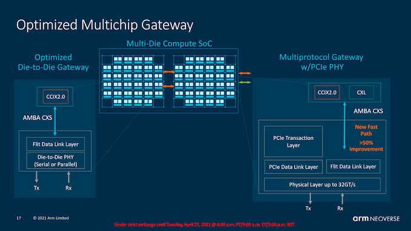
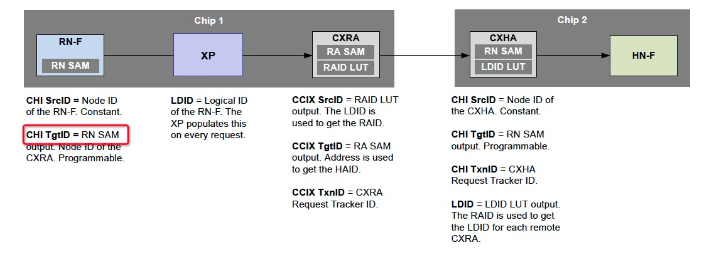
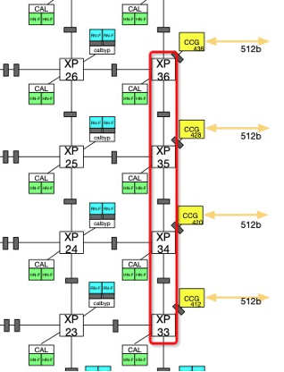

# 倚天710性能监控 —— CMN Interconnect Bandwidth Monitor with PMU Event

## REVISION HISTORY

| DATE      | VERSION | DESCRIPTION     | AUTHOR    | APPROVER    |
| --------- | ------- | --------------- | --------- | ----------- |
| 2023/2/26 | 1.0     | Initial version | Shuai Xue | Baolin Wang |

## 前言

CMN是倚天710的总线互联，所有的Filt Traffic都会经过CMN。通过CMN，我们可以统计Die to Die (D2D)，以及Socket to Socket (S2S) 之间的互连带宽。根据《倚天710性能监控 —— CMN PMU概述》我们知道，CMN中不同Node的功能不同，而负责D2D和S2S流量的，是CCG。



## 1. CXL Gateway (CCG)

A CCG bridges between CHI and CXS IssueB, which carries either CML_SMP. The CCG includes[2]:

- Request Agent (CCRA) proxy and Home Agent (CCHA) proxy functionality, which translate CHI to CML_SMP
- **CXS Link Agent (CCLA) which implements Upper Link Layer functionality of CCIX2.0 or CXL Data Link Layer**, and sits within the CCG block, which is internal to the CMN-700 hierarchy
- Optionally, an I/O coherent Requesting Node (RN-I) can be included in CCG block to handle PCIe traffic targeting remote memory or device through either fully coherent or I/O coherent Home Nodes

CMN的片内协议采用CHI协议，D2D采用CXS协议，CCG（CXL Gateway，CCG）负责CHI与CXS IssueB (CCIX2.0/CXL)的桥接。



所有CHI事务都需要一个目标ID来将数据包从源路由到目标。系统中的每个RN和HN内部要有一个系统地址映射（System Address Map, SAM），负责把地址转换成目标节点的ID。RN的SAM负责把物理地址转换成HN的ID；而HN的SAM需要把物理地址转换成SN的ID。Fig 2中为CXRA和CXHA为CXG中Node，CXG与CCG的区别在于，CXG支持的是CHI and CXS IssueA (CCIX1.1 port)[2]。

因此，要统计倚天的D2D和S2S带宽，我们需要使用CCLA的事件。如果区分CCLA事件统计的带宽为D2D还是S2S，还需要我们知道CMN的拓扑结构。

## 2. CMN-700 Topology in Yitian SoC

```bash
#lscpu
Architecture:          aarch64
Byte Order:            Little Endian
CPU(s):                128
On-line CPU(s) list:   0-127
Thread(s) per core:    1
Core(s) per socket:    128
Socket(s):             1
NUMA node(s):          2
...
```

测试环境为1个Socket，2个Die，因此，我们仅关注D2D的带宽的细节。

```python
D2D:
nodeid=0x1b5(437), logid=0x7, type=0x105(CCLA), (x,y,portid,devid)=(3,6,1,1)
nodeid=0x1ad(429), logid=0x6, type=0x105(CCLA), (x,y,portid,devid)=(3,5,1,1)
nodeid=0x1a5(421), logid=0x5, type=0x105(CCLA), (x,y,portid,devid)=(3,4,1,1)
nodeid=0x19d(413), logid=0x4, type=0x105(CCLA), (x,y,portid,devid)=(3,3,1,1)

S2S:
nodeid=0x1c9(457), logid=0xa, type=0x105(CCLA), (x,y,portid,devid)=(3,9,0,1)
nodeid=0x181(385), logid=0x2, type=0x105(CCLA), (x,y,portid,devid)=(3,0,0,1)
nodeid=0x149(329), logid=0x8, type=0x105(CCLA), (x,y,portid,devid)=(2,9,0,1)
nodeid=0x101(257), logid=0x0, type=0x105(CCLA), (x,y,portid,devid)=(2,0,0,1)
```

倚天710的CMN中，对于跨Die（D2D）带宽，是413/421/429/437四个CCLA, 对于跨socket（S2S）带宽则是 257/329/385/457四个CCLA。这里，我们仅列出关键的Node。



带宽计算公式为：

- Inter-socket RX Bandwidth = 32B _ LA_RX_CXS _ CMN_Freq / PMU_CYCLE_COUNTER
- Inter-socket TX Bandwidth = 32B _ LA_TX_CXS _ CMN_Freq / PMU_CYCLE_COUNTER
- Inter-Die RX Bandwidth = 32B _ LA_RX_CXS _ CMN_Freq / PMU_CYCLE_COUNTER
- Inter-Die TX Bandwidth = 32B _ LA_TX_CXS _ CMN_Freq / PMU_CYCLE_COUNTER

## 3. 带宽准确性验证

根据前文《倚天710性能监控 —— CMN PMU概述》我们知道，CMN既可以统计全局类型（Global Type）的事件，也可以统计指定类型（By Nodeid）的事件。我们仅统计D2D带宽，因此需要使用By Nodeid。

```bash
#sync; \
 echo 3 > /proc/sys/vm/drop_caches; \
 perf stat -e arm_cmn_0/type=0x105,eventid=0x22,bynodeid=1,nodeid=413/ \
    -e arm_cmn_0/type=0x105,eventid=0x22,bynodeid=1,nodeid=421/ \
    -e arm_cmn_0/type=0x105,eventid=0x22,bynodeid=1,nodeid=429/ \
    -e arm_cmn_0/type=0x105,eventid=0x22,bynodeid=1,nodeid=437/ \
    -e arm_cmn_0/dtc_cycles/ -a \
    numactl --cpunodebind=1  --membind=0 ./bw_mem 4096M rd
4294.97 10987.55

 Performance counter stats for 'system wide':

       810,164,744      arm_cmn_0/type=0x105,eventid=0x22,bynodeid=1,nodeid=413/         
       810,632,046      arm_cmn_0/type=0x105,eventid=0x22,bynodeid=1,nodeid=421/         
       812,716,494      arm_cmn_0/type=0x105,eventid=0x22,bynodeid=1,nodeid=429/         
       811,744,534      arm_cmn_0/type=0x105,eventid=0x22,bynodeid=1,nodeid=437/         
    12,213,460,910      arm_cmn_0/dtc_cycles/

       6.785306920 seconds time elapsed
```

这里我们使用lmbench测试集中bw_mem验证，numactl保证bw_mem产生跨Die带宽。

根据公式计算，带宽为15 GB/s；bw_mem测试的实际读数据带宽为10.9 GB/s。

```python
>>> 32*810164744*4*1.8/12213460910
15.283297534834457
>>> 10987.55/1000
10.987549999999999
```

误差主要来源于：

- 时间不准：bw_mem在统计带宽前，会将buffer初始化，还会做一次warmup，在计算带宽时，用的是有效时间；而我们用perf统计时，统计的是程序的运行时间。
- 数据不准：LA_RX_CXS事件统计的是CMN的四个CHI channles，包含了Request，Response，Snoop和Data，而bw_mem只统计了Data。

## 参考文献

[1] [https://www.anandtech.com/show/16640/arm-announces-neoverse-v1-n2-platforms-cpus-cmn700-mesh/7](https://www.anandtech.com/show/16640/arm-announces-neoverse-v1-n2-platforms-cpus-cmn700-mesh/7)

[2] CMN TRM. 2.1 Components and structural configuration

[3] CMN TRM. Figure 2-67 RN-F to remote HN-F IDs
