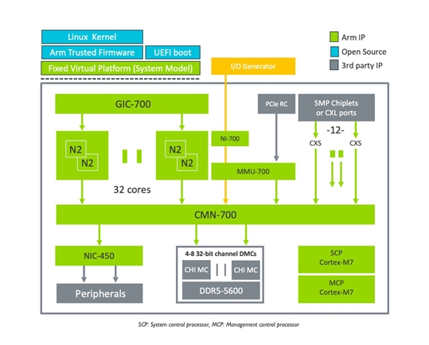
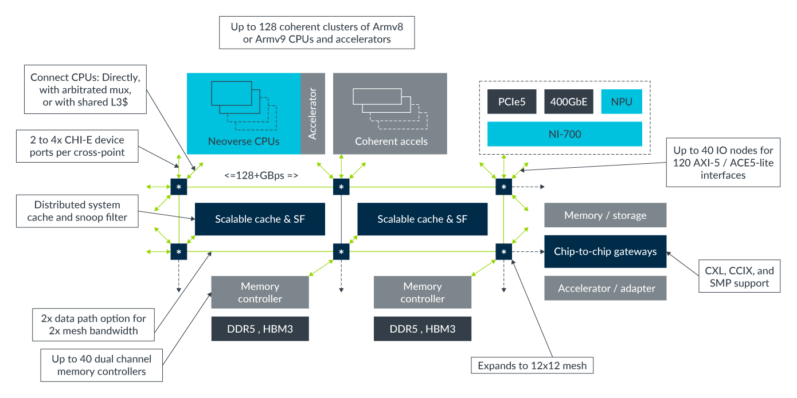
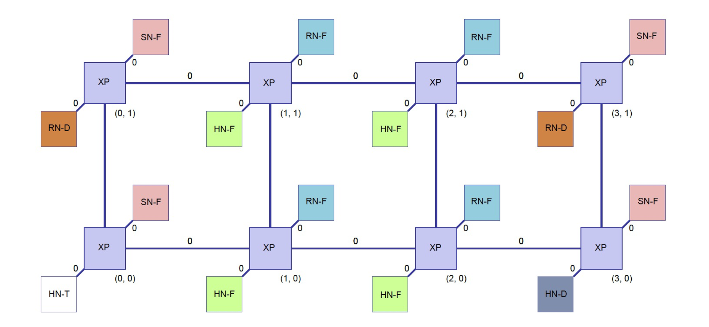
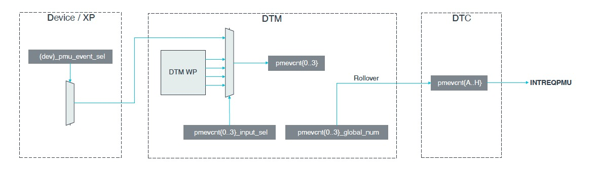

# 倚天710性能监控 —— CMN PMU概述

## REVISION HISTORY

| DATE      | VERSION | DESCRIPTION     | AUTHOR    | APPROVER    |
| --------- | ------- | --------------- | --------- | ----------- |
| 2023/2/26 | 1.0     | Initial version | Shuai Xue | Baolin Wang |

## 1. 什么是CMN

Arm Neoverse CMN-700（Coherent Mesh Network ）是一种高性能、低延迟的互连，旨在满足未来广泛市场和使用案例中基础设施的需求。Neoverse CMN-700 IP可针对以下方面进行优化：

- 大量die上核心、系统级缓存（SLC）和网格带宽可扩展性
- 配备DDR5、HBM和PCIe Gen5的高带宽内存和IO系统
- CCIX和CXL支持异构多die和多chip

构建倚天710高性能SoC的关键要素之一就是Arm CMN-700 互连总线技术，SoC中所有的核、L3 缓存、内存、外设等都通过CMN与Core互联在一起。



## 2. CMN的组成

SoC中的设备，比如Core、L3缓存、DDR控制器等先连接到Node上，然后通过XP（Crosspoint）水平和垂直互联，拓扑图如下：


下图展示了一个3*4的互联Mesh，用于具有多个RNF实例的大型系统配置，包含的Node有HN-F、RN-D、SN-F和HN-D。每个互联的Mesh，以左下角的XP为坐标原点，建立二元坐标系（X，Y）；每个XP有若干个Port，用来连接具体的设备；基于此，设备可以通过一个4元组(X, Y, Port, DeviceID) ，唯一标示，分别代表设备所在XP的坐标，Port，以及设备ID[3]。



每个类型的Node，功能不同，这里只介绍几个关键的术语：

- _RN-F: Fully coherent Request Node – Typically a CPU core, a CAL with two cores, or a DSU cluster_
- _HN-F: Fully coherent Home Node – A block of SLC cache with Snoop Filter_
- _CAL: Component Aggregation Layer – A block that houses two CPU cores connecting to one RN-F port_
- _SN-F: Slave Node_ - Connects a native memory controller, such as the CoreLink DMC-620 Dynamic Memory Controller
- _CCG: CXL Gateway_ - A CCG bridges between CHI and CXS IssueB, which carries either CML_SMP.

## 3. CMN中的PMU

CMN-700提供高速自托管调试跟踪（Debug Trace，DT）功能。CMN-700 DT系统由一组分布在互连线上的调试跟踪控制器（Debug Trace Controllers，DTC）和调试跟踪监视器（Debug Trace Monitors，DTM）组成。


CMN-700的DT系统还提供了PMU支持，PMU提供以下功能：

- 带shadown功能的local以及global计数器。
- 所有内部CMN-700设备的PMU快照。



DTM位于每个XP内，有4个local计数器（4_16b），最多可以同时统计例子连接的设备节点和/或XP本身的四个事件。DTC每个CMN实例只有2个，有8个global计数器（8_32b)，DTM中的local计数器溢出进位到global计数器中，global计数器支持溢出中断。多个CMN实例由CCIX互联起来。

## 4. cloud-kernel对倚天CMN PMU的支持

### 4.1 检查内核驱动

测试机的倚天710平台硬件环境，1个socket，2个die：

```bash
#lscpu
Architecture:          aarch64
Byte Order:            Little Endian
CPU(s):                128
On-line CPU(s) list:   0-127
Thread(s) per core:    1
Core(s) per socket:    128
Socket(s):             1
NUMA node(s):          2
...
```


每个die，都有一个单独的PMU设备：

```c
#ls /sys/bus/event_source/devices/ | grep cmn
arm_cmn_0
arm_cmn_1
```


根据CMN内部设备节点的功能不同，节点支持的PMU事件也不同，例如，HN-F连接的是SLC（L3 cache），支持的事件也是和cache相关的，比如cache miss， cache fill等。

```bash
  #perf list | grep arm_cmn
  ...
  arm_cmn_0/dtc_cycles/                               [Kernel PMU event]
  arm_cmn_0/hnf_brd_snoops_sent/                      [Kernel PMU event]
  arm_cmn_0/hnf_cache_fill/                           [Kernel PMU event]
  arm_cmn_0/hnf_cache_miss/                           [Kernel PMU event]
  ...
```

### 4.2 用法

CMN的PMU支持多种计数模式：

- Global Node Type
- 指定Node ID
- watchpoint trace

#### Global Node Type模式

倚天710的CMN频率为1.8GHz，测试Die 0上DTC的1秒内的时钟周期：

```bash
#perf stat -e arm_cmn_0/dtc_cycles/  -a -- sleep 1

 Performance counter stats for 'system wide':

     1,801,309,181      arm_cmn_0/dtc_cycles/

       1.000686864 seconds time elapsed
```


采集SLC的cache miss：

```bash
#perf stat -e arm_cmn_0/hnf_cache_miss/ -a -- sleep 1

 Performance counter stats for 'system wide':

            97,631      arm_cmn_0/hnf_cache_miss/

       1.000857754 seconds time elapsed
```

注意：默认情况下，每个事件都提供给定类型的所有节点的**聚合计数，即上面例子统计的是Die 0所有SLC的miss的次数和。**


#### ByNodeID模式

PMU可以通过bynodeid，统计某一特定设备的事件。例如，x,y,portid,devid=(3,6,1,1)处的CCLA设备，采样事件为LA_RX_CXS：

```bash
#perf stat -e arm_cmn_0/type=0x105,eventid=0x21,bynodeid=1,nodeid=0x1b5/ -a sleep 1

 Performance counter stats for 'system wide':

            156609      arm_cmn_0/type=0x105,eventid=0x21,bynodeid=1,nodeid=0x1b5/

       1.001515360 seconds time elapsed
```

- type：设备节点的类型
- eventid：计数的事件ID
- bynodeid：必须置为1，指明计数为bynodeid模式
- nodeid：设备节点的nodeid

#### Watchpoint模式

PMU还可以统计watchpoint事件，以监控特定的flit流量。watchpoint的为驱动合成的设备节点类型，事件类型为0x7770，硬件中并不存在。与PMU一样，事件可以是全局的，也可以是针对特定XP的。

```
#perf stat -e arm_cmn_0/type=0x7770,eventid=0x0,bynodeid=1,nodeid=0x198,wp_dev_sel=0x1,wp_chn_sel=0x3,wp_grp=0x0,wp_val=0x0,wp_mask=0xFFFFFFFFFFFFFFFF/ -a -- sleep 1

 Performance counter stats for 'system wide':

             8,466      arm_cmn_0/type=0x7770,eventid=0x0,bynodeid=1,nodeid=0x198,wp_dev_sel=0x1,wp_chn_sel=0x3,wp_grp=0x0,wp_val=0x0,wp_mask=0xFFFFFFFFFFFFFFFF/              

       1.000716738 seconds time elapsed
```

- type=0x7770, watchpoint
- eventid: 0x0 for uploads, 0x2 for downloads
- bynodeid=1,nodeid=0x198: specify nodeid of XP which includes CCG
- wp_dev_sel:0x1 for CCG
- wp_chn_sel: 0x3 for DATA VC
- wp_grp: 0x0 for primary group (WP 0,2 for primary group, WP 1,3 for secondary group)
- wp_val=0x0: reset value
- wp_mask=0xFFFFFFFFFFFFFFFF: All fields in the primary match group will be ignored so that any upload DAT flit would be a match


## 参考文献

[1]. [https://community.arm.com/arm-community-blogs/b/architectures-and-processors-blog/posts/arm-neoverse-n2-industry-leading-performance-efficiency](https://community.arm.com/arm-community-blogs/b/architectures-and-processors-blog/posts/arm-neoverse-n2-industry-leading-performance-efficiency)

[2]. [https://armkeil.blob.core.windows.net/developer/Files/pdf/solution_overview-corelink-cmn-700.pdf](https://armkeil.blob.core.windows.net/developer/Files/pdf/solution_overview-corelink-cmn-700.pdf)

[3]. CMN TRM. 2.4.1 Node ID mapping

[4]. CMN TRM. Figure 2-14 Mesh example 4*2

[5]. CMN TRM. Figure 5-7 PMU local and global performance counters

