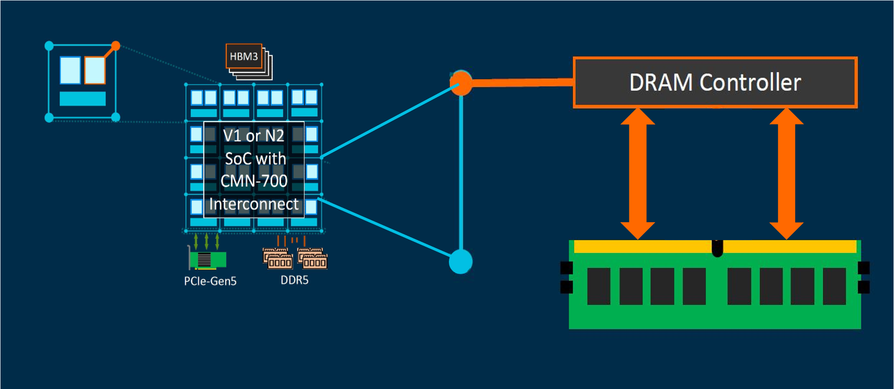
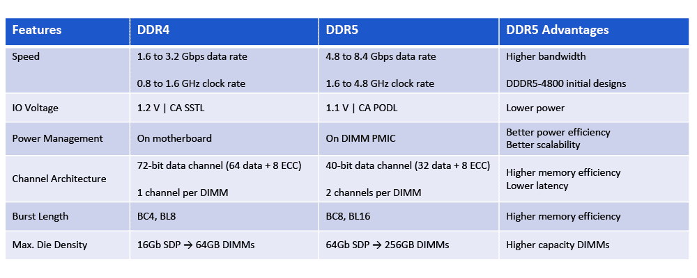
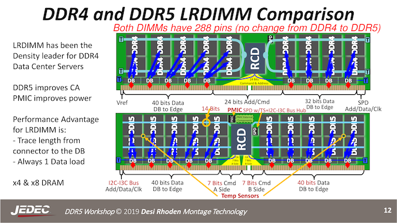

# 倚天710性能监控 —— DDR PMU子系统

## REVISION HISTORY

| DATE      | VERSION | DESCRIPTION     | AUTHOR    | APPROVER    |
| --------- | ------- | --------------- | --------- | ----------- |
| 2023/2/26 | 1.0     | Initial version | Shuai Xue | Baolin Wang |

## 前言

文章《倚天710性能监控 —— CMN Flit Traffic Trace with Watchpoint Event》我们介绍了如何利用倚天710 CMN的PMU，统计总线的跨Die带宽和跨Socket带宽。本文介绍如何利用倚天710的DDR子系统的PMU（DDR Sub-System Performance Monitoring Unit），统计DDR带宽。

## 1. 倚天710的DDR5子系统

倚天710支持支持最先进的DDR5 DRAM，为云计算和HPC提供巨大的内存带宽。倚天710有8 DDR5通道（channel），每个Die上有4个。每个通道相互独立地服务系统的内存请求，分别支持用于1DPC（DIMM Per Channel）的DDR5-4400和2DPC的DDR5-4000。



### 1.2 DDR5 Architecture


DDR5的一个主要变化是新的DIMM通道结构（Fig 2中Channel Architecture）。DDR4 DIMM的总线位宽为72比特，由64比特数据位和8比特ECC位组成。DDR5的每个DIMM有两个独立的子通道。两个通道中的总线位宽都为40比特：32比特的数据位和8比特的ECC位。尽管DDR4和DDR5的数据位宽相同（总共64比特），但两个独立通道可以提高内存访问效率并减少延迟。单通道单次任务只能读或写，双通道的DDR5则读写可以同时进行。



### 1.2 DDR5 理论带宽

倚天2DPC的DDR5-4000的理论带宽为：

- 4000MHz _ 32bit / 8 _ 8 _ 2 = 128 _ 10^9 _ 2 bytes = 128GB/s _ 2= 256 GB/s
- 内存等效频率（4000MHz）_ 子通道位宽（32 bit）/ 8 _ 子通道数（8）* Die （2）

注意GB和GiB的不同：

- 1 GB = 1000000000 bytes (= 1000^3 B = 10^9 B)
- 1 GiB = 1073741824 bytes (= 1024^3 B = 2^30 B).

## 2. 倚天710 DDRSS PMU

倚天710的DDRSS为每个子通道都实现了独立的PMU，用于性能和功能调试，每个子通道的PMU包含16个通用计数器。支持的事件有：

| Event ID | Event Name | Description |
| --- | --- | --- |
| 0x00 | perf_hif_rd_or_wr | A Write or Read Op at HIF interface. 32B |
| 0x01 | perf_hif_wr | A Write Op at HIF interface. 32B |
| 0x02 | perf_hif_rd | A Read Op at HIF interface. 32B |
| 0x03 | perf_hif_rmw | A Read-Modify-Write Op at HIF interface. 32B |
| 0x04 | perf_hif_hi_pri_rd | A high priority Read at HIF interface. 32B |
| 0x05 | Reserved | Reserved |
| 0x06 | Reserved | Reserved |
| 0x07 | perf_dfi_wr_data_cycles | A write data cycle at DFI interface (to DRAM) |
| 0x08 | perf_dfi_rd_data_cycles | A read data cycle at DFI interface (to DRAM) |
| 0x09 | perf_hpr_xact_when_critical | A high priority read becomes critical |
| 0x0A | perf_lpr_xact_when_critical | A low priority read becomes critical |
| 0x0B | perf_wr_xact_when_critical | A write becomes critical |
| 0x0C | perf_op_is_activate | An Activate (ACT) command to DRAM |
| 0x0D | perf_op_is_rd_or_wr | A Read or Write CAS command to DRAM |
| 0x0E | perf_op_is_rd_activate | An ACT command for read to DRAM |
| 0x0F | perf_op_is_rd | A Read CAS command to DRAM |
| 0x10 | perf_op_is_wr | A Write CAS command to DRAM |
| 0x11 | perf_op_is_mwr | A Masked Write command to DRAM |
| 0x12 | perf_op_is_precharge | A Precharge (PRE) command to DRAM |
| 0x13 | perf_precharge_for_rdwr | A PRE required by read or write |
| 0x14 | perf_precharge_for_other | A PRE required by other conditions |
| 0x15 | perf_rdwr_transitions | A read-write turnaround |
| 0x16 | perf_write_combine | A write combine (merge) in write data buffer |
| 0x17 | perf_war_hazard | A Write-After-Read hazard |
| 0x18 | perf_raw_hazard | A Read-After-Write hazard |
| 0x19 | perf_waw_hazard | A Write-After-Write hazard |
| 0x1A | perf_op_is_enter_selfref_rk0 | Rank0 enters self-refresh (SRE) |
| 0x1B | perf_op_is_enter_selfref_rk1 | Rank1 enters self-refresh (SRE) |
| 0x1C | perf_op_is_enter_selfref_rk2 | Rank2 enters self-refresh (SRE) |
| 0x1D | perf_op_is_enter_selfref_rk3 | Rank3 enters self-refresh (SRE) |
| 0x1E | perf_op_is_enter_powerdown_rk0 | Rank0 enters power-down (PDE) |
| 0x1F | perf_op_is_enter_powerdown_rk1 | Rank1 enters power-down (PDE) |
| 0x20 | perf_op_is_enter_powerdown_rk2 | Rank2 enters power-down (PDE) |
| 0x21 | perf_op_is_enter_powerdown_rk3 | Rank3 enters power-down (PDE) |
| 0x22 | perf_op_is_enter_mpsm_rk0 | ~Rank0 enters MPSM;~ |
| 0x23 | perf_op_is_enter_mpsm_rk1 | ~Rank1 enters MPSM;~ |
| 0x24 | perf_op_is_enter_mpsm_rk2 | ~Rank2 enters MPSM;~ |
| 0x25 | perf_op_is_enter_mpsm_rk3 | ~Rank3 enters MPSM;~ |
| 0x26 | perf_selfref_mode_rk0 | A cycle that Rank0 stays in self-refresh mode |
| 0x27 | perf_selfref_mode_rk1 | A cycle that Rank1 stays in self-refresh mode |
| 0x28 | perf_selfref_mode_rk2 | A cycle that Rank2 stays in self-refresh mode |
| 0x29 | perf_selfref_mode_rk3 | A cycle that Rank3 stays in self-refresh mode |
| 0x2A | perf_op_is_refresh | An auto-refresh (REF) command to DRAM |
| 0x2B | perf_op_is_crit_ref | A critical REF command to DRAM |
| 0x2C | perf_op_is_spec_ref | ~A speculative REF command to DRAM;~ |
| 0x2D | perf_op_is_load_mode | An MRR or MRW command to DRAM |
| 0x2E | perf_op_is_zqcl | A ZQCal command to DRAM; |
| 0x2F | perf_op_is_zqcs | ~A ZQCal Short command to DRAM;~ |
| 0x30 | perf_visible_window_limit_reached_rd | At least one entry in read queue reaches the visible window limit |
| 0x31 | perf_visible_window_limit_reached_wr | At least one entry in write queue reaches the visible window limit |
| 0x32 | Reserved | Reserved |
| 0x33 | Reserved | Reserved |
| 0x34 | perf_op_is_dqsosc_mpc | A DQS Oscillator MPC command to DRAM |
| 0x35 | perf_op_is_dqsosc_mrr | A DQS Oscillator MRR command to DRAM |
| 0x36 | perf_op_is_tcr_mrr | A TCR (Temperature Compensated Refresh) MRR command to DRAM |
| 0x37 | perf_op_is_zqstart | A ZQCal Start command to DRAM |
| 0x38 | perf_op_is_zqlatch | A ZQCal Latch command to DRAM |
| 0x39 | perf_chi_txreq | A packet at CHI TXREQ interface (request) |
| 0x3A | perf_chi_txdat | A packet at CHI TXDAT interface (read data) |
| 0x3B | perf_chi_rxdat | A packet at CHI RXDAT interface (write data) |
| 0x3C | perf_chi_rxrsp | A packet at CHI RXRSP interface |
| 0x3D | perf_tzc_vio | A violation detected in TZC |


带宽计算公式为：

- DRAM Read Bandwidth =  perf_hif_rd _ DDRC_WIDTH _ DDRC_Freq / DDRC_Cycle
- DRAM Write Bandwidth = (perf_hif_wr + perf_hif_rmw) _ DDRC_WIDTH _ DDRC_Freq / DDRC_Cycle
- DDRC_WIDTH: Units of 64 bytes

## 3. Cloud-kernel对DDRSS PMU的支持

```bash
#lscpu
Architecture:          aarch64
Byte Order:            Little Endian
CPU(s):                128
On-line CPU(s) list:   0-127
Thread(s) per core:    1
Core(s) per socket:    128
Socket(s):             1
NUMA node(s):          2
...
```

测试环境为1个Socket，2个Die，包含两个NUMA node。

```bash
#numactl -H
available: 2 nodes (0-1)
node 0 cpus: 0 1 2 3 4 5 6 7 8 9 10 11 12 13 14 15 16 17 18 19 20 21 22 23 24 25 26 27 28 29 30 31 32 33 34 35 36 37 38 39 40 41 42 43 44 45 46 47 48 49 50 51 52 53 54 55 56 57 58 59 60 61 62 63
node 0 size: 257416 MB
node 0 free: 187991 MB
node 1 cpus: 64 65 66 67 68 69 70 71 72 73 74 75 76 77 78 79 80 81 82 83 84 85 86 87 88 89 90 91 92 93 94 95 96 97 98 99 100 101 102 103 104 105 106 107 108 109 110 111 112 113 114 115 116 117 118 119 120 121 122 123 124 125 126 127
node 1 size: 257014 MB
node 1 free: 194504 MB
node distances:
node   0   1
  0:  10  15
  1:  15  10
```

每个NUMA node有 256 GB内存。

```
#dmidecode|grep -P -A5 "Memory\s+Device"|grep Size|grep -v Range
        Size: 32 GB
        Size: 32 GB
        Size: 32 GB
        Size: 32 GB
        Size: 32 GB
        Size: 32 GB
        Size: 32 GB
        Size: 32 GB
        Size: 32 GB
        Size: 32 GB
        Size: 32 GB
        Size: 32 GB
        Size: 32 GB
        Size: 32 GB
        Size: 32 GB
        Size: 32 GB
        Size: No Module Installed
 ...

#dmidecode -t memory | grep Speed:
        Speed: 4000 MHz
        Configured Clock Speed: 4000 MHz
```

2DPC，共插了16根DIMM，每个Die8根DIMM，有效频率为 4000MHz。

```
#ls /sys/bus/event_source/devices/ | grep drw
ali_drw_21000
ali_drw_21080
ali_drw_23000
ali_drw_23080
ali_drw_25000
ali_drw_25080
ali_drw_27000
ali_drw_27080
ali_drw_40021000
ali_drw_40021080
ali_drw_40023000
ali_drw_40023080
ali_drw_40025000
ali_drw_40025080
ali_drw_40027000
ali_drw_40027080
```

2DPC满插时一共16个PMU设备，其中`ali_drw_21000`与`ali_drw_21080`为Die 0上同一个DIMM的两个子通道，`ali_drw_2X000`为Die 0的PMU设备，`ali_drw_4002X000`为Die 1的PMU设备。

## 4. DDR 带宽准确性验证

### 4.1 TL;DR
| Case | Command | bw_mem | DDR PMU | Error |
| --- | --- | --- | --- | --- |
| C0M0 rd | numactl --cpubind=0 --membind=0 ./bw_mem 40960M rd | 20507.82 | 20561.68 | 0.26% |
| C1M1 rd | numactl --cpubind=1 --membind=1 ./bw_mem 40960M rd | 20492.53 | 20516.30 | 0.12% |
| C0M0 fwr | numactl --cpubind=0 --membind=0 ./bw_mem 40960M fwr | 21936.50 | 21969.23 | 0.15% |
| C1M1 fwr | numactl --cpubind=1 --membind=1 ./bw_mem 40960M fwr | 21934.51 | 21966.89 | 0.15% |


带宽单位：MB/s

可以看到，DDR PMU的带宽统计误差不超过 1%。测试原理，请阅读《倚天710性能监控 —— CMN Flit Traffic Trace with Watchpoint Event》。

### 4.2 C0M0 rd

```
# First, run bw_mem as backgroud workload
# numactl --cpubind=0 --membind=0 ./bw_mem 40960M rd

# Then run perf command in another console
perf stat \
  -e ali_drw_21000/perf_hif_wr/ \
  -e ali_drw_21000/perf_hif_rd/ \
  -e ali_drw_21000/perf_hif_rmw/ \
  -e ali_drw_21000/perf_cycle/ \
  -e ali_drw_21080/perf_hif_wr/ \
  -e ali_drw_21080/perf_hif_rd/ \
  -e ali_drw_21080/perf_hif_rmw/ \
  -e ali_drw_21080/perf_cycle/ \
  -e ali_drw_23000/perf_hif_wr/ \
  -e ali_drw_23000/perf_hif_rd/ \
  -e ali_drw_23000/perf_hif_rmw/ \
  -e ali_drw_23000/perf_cycle/ \
  -e ali_drw_23080/perf_hif_wr/ \
  -e ali_drw_23080/perf_hif_rd/ \
  -e ali_drw_23080/perf_hif_rmw/ \
  -e ali_drw_23080/perf_cycle/ \
  -e ali_drw_25000/perf_hif_wr/ \
  -e ali_drw_25000/perf_hif_rd/ \
  -e ali_drw_25000/perf_hif_rmw/ \
  -e ali_drw_25000/perf_cycle/ \
  -e ali_drw_25080/perf_hif_wr/ \
  -e ali_drw_25080/perf_hif_rd/ \
  -e ali_drw_25080/perf_hif_rmw/ \
  -e ali_drw_25080/perf_cycle/ \
  -e ali_drw_27000/perf_hif_wr/ \
  -e ali_drw_27000/perf_hif_rd/ \
  -e ali_drw_27000/perf_hif_rmw/ \
  -e ali_drw_27000/perf_cycle/ \
  -e ali_drw_27080/perf_hif_wr/ \
  -e ali_drw_27080/perf_hif_rd/ \
  -e ali_drw_27080/perf_hif_rmw/ \
  -e ali_drw_27080/perf_cycle/ \
  -a -- sleep 1

Performance counter stats for 'system wide':

             12398      ali_drw_21000/perf_hif_wr/
          40160751      ali_drw_21000/perf_hif_rd/
               743      ali_drw_21000/perf_hif_rmw/
         500620725      ali_drw_21000/perf_cycle/
             12252      ali_drw_21080/perf_hif_wr/
          40161013      ali_drw_21080/perf_hif_rd/
               767      ali_drw_21080/perf_hif_rmw/
         500619340      ali_drw_21080/perf_cycle/
             11960      ali_drw_23000/perf_hif_wr/
          40159522      ali_drw_23000/perf_hif_rd/
               737      ali_drw_23000/perf_hif_rmw/
         500613505      ali_drw_23000/perf_cycle/
             12044      ali_drw_23080/perf_hif_wr/
          40159066      ali_drw_23080/perf_hif_rd/
               773      ali_drw_23080/perf_hif_rmw/
         500607620      ali_drw_23080/perf_cycle/
             12698      ali_drw_25000/perf_hif_wr/
          40160138      ali_drw_25000/perf_hif_rd/
               709      ali_drw_25000/perf_hif_rmw/
         500601240      ali_drw_25000/perf_cycle/
             12521      ali_drw_25080/perf_hif_wr/
          40160169      ali_drw_25080/perf_hif_rd/
               727      ali_drw_25080/perf_hif_rmw/
         500594755      ali_drw_25080/perf_cycle/
             12171      ali_drw_27000/perf_hif_wr/
          40159404      ali_drw_27000/perf_hif_rd/
               706      ali_drw_27000/perf_hif_rmw/
         500589945      ali_drw_27000/perf_cycle/
             12290      ali_drw_27080/perf_hif_wr/
          40157620      ali_drw_27080/perf_hif_rd/
               710      ali_drw_27080/perf_hif_rmw/
         500583305      ali_drw_27080/perf_cycle/

       1.000923276 seconds time elapsed

>>> 40159522*8*64/1000/1000.0
20561.675

# set  CPU and memory to the same NUMA node
numactl --cpubind=0 --membind=0 ./bw_mem 40960M rd
40960.00 20507.82
```

### 4.3 C1M1 rd

```
# First, run bw_mem as backgroud workload
# numactl --cpubind=1 --membind=1 ./bw_mem 40960M rd

# Then run perf command in another console
perf stat \
  -e ali_drw_40021000/perf_hif_wr/ \
  -e ali_drw_40021000/perf_hif_rd/ \
  -e ali_drw_40021000/perf_hif_rmw/ \
  -e ali_drw_40021000/perf_cycle/ \
  -e ali_drw_40021080/perf_hif_wr/ \
  -e ali_drw_40021080/perf_hif_rd/ \
  -e ali_drw_40021080/perf_hif_rmw/ \
  -e ali_drw_40021080/perf_cycle/ \
  -e ali_drw_40023000/perf_hif_wr/ \
  -e ali_drw_40023000/perf_hif_rd/ \
  -e ali_drw_40023000/perf_hif_rmw/ \
  -e ali_drw_40023000/perf_cycle/ \
  -e ali_drw_40023080/perf_hif_wr/ \
  -e ali_drw_40023080/perf_hif_rd/ \
  -e ali_drw_40023080/perf_hif_rmw/ \
  -e ali_drw_40023080/perf_cycle/ \
  -e ali_drw_40025000/perf_hif_wr/ \
  -e ali_drw_40025000/perf_hif_rd/ \
  -e ali_drw_40025000/perf_hif_rmw/ \
  -e ali_drw_40025000/perf_cycle/ \
  -e ali_drw_40025080/perf_hif_wr/ \
  -e ali_drw_40025080/perf_hif_rd/ \
  -e ali_drw_40025080/perf_hif_rmw/ \
  -e ali_drw_40025080/perf_cycle/ \
  -e ali_drw_40027000/perf_hif_wr/ \
  -e ali_drw_40027000/perf_hif_rd/ \
  -e ali_drw_40027000/perf_hif_rmw/ \
  -e ali_drw_40027000/perf_cycle/ \
  -e ali_drw_40027080/perf_hif_wr/ \
  -e ali_drw_40027080/perf_hif_rd/ \
  -e ali_drw_40027080/perf_hif_rmw/ \
  -e ali_drw_40027080/perf_cycle/ \
  -a -- sleep 1

 Performance counter stats for 'system wide':

              2329      ali_drw_40021000/perf_hif_wr/
          40071983      ali_drw_40021000/perf_hif_rd/
                58      ali_drw_40021000/perf_hif_rmw/
         500572165      ali_drw_40021000/perf_cycle/
              2374      ali_drw_40021080/perf_hif_wr/
          40071737      ali_drw_40021080/perf_hif_rd/
                39      ali_drw_40021080/perf_hif_rmw/
         500569615      ali_drw_40021080/perf_cycle/
              2330      ali_drw_40023000/perf_hif_wr/
          40071063      ali_drw_40023000/perf_hif_rd/
                74      ali_drw_40023000/perf_hif_rmw/
         500565635      ali_drw_40023000/perf_cycle/
              2372      ali_drw_40023080/perf_hif_wr/
          40070344      ali_drw_40023080/perf_hif_rd/
                54      ali_drw_40023080/perf_hif_rmw/
         500561355      ali_drw_40023080/perf_cycle/
              2362      ali_drw_40025000/perf_hif_wr/
          40070906      ali_drw_40025000/perf_hif_rd/
                45      ali_drw_40025000/perf_hif_rmw/
         500557480      ali_drw_40025000/perf_cycle/
              2385      ali_drw_40025080/perf_hif_wr/
          40070168      ali_drw_40025080/perf_hif_rd/
                46      ali_drw_40025080/perf_hif_rmw/
         500552550      ali_drw_40025080/perf_cycle/
              2333      ali_drw_40027000/perf_hif_wr/
          40069233      ali_drw_40027000/perf_hif_rd/
                28      ali_drw_40027000/perf_hif_rmw/
         500548745      ali_drw_40027000/perf_cycle/
              2211      ali_drw_40027080/perf_hif_wr/
          40068227      ali_drw_40027080/perf_hif_rd/
                30      ali_drw_40027080/perf_hif_rmw/
         500544450      ali_drw_40027080/perf_cycle/

       1.000863258 seconds time elapsed

>>> 40070906*8*64/1000/1000.0
20516.303

numactl --cpubind=1 --membind=1 ./bw_mem 40960M rd
40960.00 20492.53
```

### 4.4 C0M0 fwr

```
# First, run bw_mem as backgroud workload
# numactl --cpubind=0 --membind=0 ./bw_mem 40960M fwr

# Then run perf command in another console
perf stat \
  -e ali_drw_21000/perf_hif_wr/ \
  -e ali_drw_21000/perf_hif_rd/ \
  -e ali_drw_21000/perf_hif_rmw/ \
  -e ali_drw_21000/perf_cycle/ \
  -e ali_drw_21080/perf_hif_wr/ \
  -e ali_drw_21080/perf_hif_rd/ \
  -e ali_drw_21080/perf_hif_rmw/ \
  -e ali_drw_21080/perf_cycle/ \
  -e ali_drw_23000/perf_hif_wr/ \
  -e ali_drw_23000/perf_hif_rd/ \
  -e ali_drw_23000/perf_hif_rmw/ \
  -e ali_drw_23000/perf_cycle/ \
  -e ali_drw_23080/perf_hif_wr/ \
  -e ali_drw_23080/perf_hif_rd/ \
  -e ali_drw_23080/perf_hif_rmw/ \
  -e ali_drw_23080/perf_cycle/ \
  -e ali_drw_25000/perf_hif_wr/ \
  -e ali_drw_25000/perf_hif_rd/ \
  -e ali_drw_25000/perf_hif_rmw/ \
  -e ali_drw_25000/perf_cycle/ \
  -e ali_drw_25080/perf_hif_wr/ \
  -e ali_drw_25080/perf_hif_rd/ \
  -e ali_drw_25080/perf_hif_rmw/ \
  -e ali_drw_25080/perf_cycle/ \
  -e ali_drw_27000/perf_hif_wr/ \
  -e ali_drw_27000/perf_hif_rd/ \
  -e ali_drw_27000/perf_hif_rmw/ \
  -e ali_drw_27000/perf_cycle/ \
  -e ali_drw_27080/perf_hif_wr/ \
  -e ali_drw_27080/perf_hif_rd/ \
  -e ali_drw_27080/perf_hif_rmw/ \
  -e ali_drw_27080/perf_cycle/ \
  -a -- sleep 1

 Performance counter stats for 'system wide':

          42910737      ali_drw_21000/perf_hif_wr/
            108397      ali_drw_21000/perf_hif_rd/
               495      ali_drw_21000/perf_hif_rmw/
         500708510      ali_drw_21000/perf_cycle/
          42911223      ali_drw_21080/perf_hif_wr/
            117280      ali_drw_21080/perf_hif_rd/
               515      ali_drw_21080/perf_hif_rmw/
         500706780      ali_drw_21080/perf_cycle/
          42910038      ali_drw_23000/perf_hif_wr/
            109179      ali_drw_23000/perf_hif_rd/
               516      ali_drw_23000/perf_hif_rmw/
         500702100      ali_drw_23000/perf_cycle/
          42911620      ali_drw_23080/perf_hif_wr/
            111038      ali_drw_23080/perf_hif_rd/
               523      ali_drw_23080/perf_hif_rmw/
         500697340      ali_drw_23080/perf_cycle/
          42910435      ali_drw_25000/perf_hif_wr/
            111748      ali_drw_25000/perf_hif_rd/
               469      ali_drw_25000/perf_hif_rmw/
         500692500      ali_drw_25000/perf_cycle/
          42908786      ali_drw_25080/perf_hif_wr/
            110177      ali_drw_25080/perf_hif_rd/
               456      ali_drw_25080/perf_hif_rmw/
         500686595      ali_drw_25080/perf_cycle/
          42908903      ali_drw_27000/perf_hif_wr/
            114093      ali_drw_27000/perf_hif_rd/
               490      ali_drw_27000/perf_hif_rmw/
         500681405      ali_drw_27000/perf_cycle/
          42908156      ali_drw_27080/perf_hif_wr/
            109668      ali_drw_27080/perf_hif_rd/
               489      ali_drw_27080/perf_hif_rmw/
         500676420      ali_drw_27080/perf_cycle/

       1.001100811 seconds time elapsed
>>> (42908156+489)*8*64/1000/1000.0
21969.226

numactl --cpubind=0 --membind=0 ./bw_mem 40960M fwr
40960.00 21936.50
```

### 4.5 C1M1 fwr

```
# First, run bw_mem as backgroud workload
# numactl --cpubind=1 --membind=1 ./bw_mem 40960M fwr

# Then run perf command in another console
perf stat \
  -e ali_drw_40021000/perf_hif_wr/ \
  -e ali_drw_40021000/perf_hif_rd/ \
  -e ali_drw_40021000/perf_hif_rmw/ \
  -e ali_drw_40021000/perf_cycle/ \
  -e ali_drw_40021080/perf_hif_wr/ \
  -e ali_drw_40021080/perf_hif_rd/ \
  -e ali_drw_40021080/perf_hif_rmw/ \
  -e ali_drw_40021080/perf_cycle/ \
  -e ali_drw_40023000/perf_hif_wr/ \
  -e ali_drw_40023000/perf_hif_rd/ \
  -e ali_drw_40023000/perf_hif_rmw/ \
  -e ali_drw_40023000/perf_cycle/ \
  -e ali_drw_40023080/perf_hif_wr/ \
  -e ali_drw_40023080/perf_hif_rd/ \
  -e ali_drw_40023080/perf_hif_rmw/ \
  -e ali_drw_40023080/perf_cycle/ \
  -e ali_drw_40025000/perf_hif_wr/ \
  -e ali_drw_40025000/perf_hif_rd/ \
  -e ali_drw_40025000/perf_hif_rmw/ \
  -e ali_drw_40025000/perf_cycle/ \
  -e ali_drw_40025080/perf_hif_wr/ \
  -e ali_drw_40025080/perf_hif_rd/ \
  -e ali_drw_40025080/perf_hif_rmw/ \
  -e ali_drw_40025080/perf_cycle/ \
  -e ali_drw_40027000/perf_hif_wr/ \
  -e ali_drw_40027000/perf_hif_rd/ \
  -e ali_drw_40027000/perf_hif_rmw/ \
  -e ali_drw_40027000/perf_cycle/ \
  -e ali_drw_40027080/perf_hif_wr/ \
  -e ali_drw_40027080/perf_hif_rd/ \
  -e ali_drw_40027080/perf_hif_rmw/ \
  -e ali_drw_40027080/perf_cycle/ \
  -a -- sleep 1

 Performance counter stats for 'system wide':

          42906048      ali_drw_40021000/perf_hif_wr/
             33939      ali_drw_40021000/perf_hif_rd/
                76      ali_drw_40021000/perf_hif_rmw/
         500629355      ali_drw_40021000/perf_cycle/
          42905967      ali_drw_40021080/perf_hif_wr/
             34018      ali_drw_40021080/perf_hif_rd/
                63      ali_drw_40021080/perf_hif_rmw/
         500631900      ali_drw_40021080/perf_cycle/
          42905422      ali_drw_40023000/perf_hif_wr/
             33843      ali_drw_40023000/perf_hif_rd/
                75      ali_drw_40023000/perf_hif_rmw/
         500628540      ali_drw_40023000/perf_cycle/
          42905547      ali_drw_40023080/perf_hif_wr/
             33858      ali_drw_40023080/perf_hif_rd/
                68      ali_drw_40023080/perf_hif_rmw/
         500623970      ali_drw_40023080/perf_cycle/
          42905230      ali_drw_40025000/perf_hif_wr/
             34028      ali_drw_40025000/perf_hif_rd/
                56      ali_drw_40025000/perf_hif_rmw/
         500620630      ali_drw_40025000/perf_cycle/
          42904734      ali_drw_40025080/perf_hif_wr/
             34141      ali_drw_40025080/perf_hif_rd/
                61      ali_drw_40025080/perf_hif_rmw/
         500615840      ali_drw_40025080/perf_cycle/
          42903390      ali_drw_40027000/perf_hif_wr/
             33712      ali_drw_40027000/perf_hif_rd/
                84      ali_drw_40027000/perf_hif_rmw/
         500610635      ali_drw_40027000/perf_cycle/
          42903975      ali_drw_40027080/perf_hif_wr/
             33916      ali_drw_40027080/perf_hif_rd/
               106      ali_drw_40027080/perf_hif_rmw/
         500606645      ali_drw_40027080/perf_cycle/

       1.000953335 seconds time elapsed

>>> (42903975+106)*8*64/1000/1000.0
21966.889

#numactl --cpubind=1 --membind=1 ./bw_mem 40960M fwr
40960.00 21934.51
```

## 5. 参考文献

[1]. [https://www.anandtech.com/show/15912/ddr5-specification-released-setting-the-stage-for-ddr56400-and-beyond](https://www.anandtech.com/show/15912/ddr5-specification-released-setting-the-stage-for-ddr56400-and-beyond)

[2]. [https://www.rambus.com/blogs/get-ready-for-ddr5-dimm-chipsets/](https://www.rambus.com/blogs/get-ready-for-ddr5-dimm-chipsets/)
