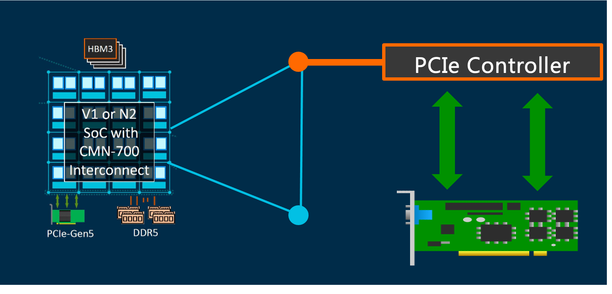

# 倚天710性能监控 —— PCIe PMU子系统

## REVISION HISTORY

| DATE      | VERSION | DESCRIPTION     | AUTHOR    | APPROVER    |
| --------- | ------- | --------------- | --------- | ----------- |
| 2023/2/26 | 1.0     | Initial version | Shuai Xue | Baolin Wang |

## 前言

《倚天710性能监控 —— CMN PMU概述》、《倚天710性能监控 —— DDR PMU子系统》等文章我们介绍了倚天710 CMN PMU子系统和DDR PMU子系统，本文介绍倚天PCIe PMU子系统。



## 1. 倚天710的PCIe Gen5子系统
The following features are supported by PCIe Complex (RC):

- Support up to PCIe Gen5 (32GT/s)
- **Each die has 3 x16 lane RC (RC0, RC1, RC2), total 48 lanes  (RC3 is for ACC only)**
- Each x16 RC controller support PCIe and CCIX dual system configuration
- Every x16 lane RC supports bifurcation mode include:  x16, x8+x8, x8+x4+x4, or x4+x4+x4+x4.
- Support PCIe Peer-to-Peer transaction with address-based routing
- RC included in-house designed Host Bridge

## 2. 倚天710的PCIe PMU子系统

### 2.1 Hardware Counter

To facilitate collection of statistics the controller provides the following features:

- Time Based Analysis (RX/TX data throughput and time spent in each low-power LTSSMstate), a 64 bit coutner
- Event (Error and Non-Error) across different layers of PCIe protocol, a 32 bit counter

倚天710每个Root Port分别实现了1个单独的PMU计数器，用于用于性能和功能调试。

### 2.2 Hardware Events

硬件支持的事件包括：

- Time-based Analysis Counter Group #0 (32-bit Low-Power Cycle Counter (RAM)
| Event # | % of Measurement Window Spent in LTSSM State | Note |
| --- | --- | --- |
| 0x01 | Tx L0s | - |
| 0x02 | Rx L0s | - |
| 0x03 | L0 | - |
| 0x04 | L1 | The controller (PMC) is running on core_clk |
| 0x05 | L1.1 | - |
| 0x06 | L1.2 | - |
| 0x07 | Configuration/Recovery | - |
| 0x08 | L1 aux | The controller (PMC) is running on aux_clk |
| 0x09 | Tx L0s and Rx L0s | - |


- Time-based Analysis Counter Group #1 (32-bit Throughput 4-DWORD Counter)
| Event # | Amount of Data Processed (Units of 16 bytes) | Note |
| --- | --- | --- |
| 0x00 | Tx PCIe TLP Data Payload | - |
| 0x01 | Rx PCIe TLP Data Payload | - |
| 0x02 | Tx CCIX TLP Data Payload | PCIe Compatible TLP: CCIX TLP Data Payload consists of the data payload + TLP Header DW3CCIX Optimized TLP: CCIX TLP Data Payload consists of the data payload + 1 DW header |
| 0x03 | Rx CCIX TLP Data Payload | PCIe Compatible TLP: CCIX TLP Data Payload consists of the data payload + TLP Header DW3CCIX Optimized TLP: CCIX TLP Data Payload consists of the data payload + 1 DW header |


- Event Counter Group #0 (4-bit Layer1 Error Counter Per-Lane)
| Event # | Description | Note |
| --- | --- | --- |
| 0x00 | EBUF Overflow | - |
| 0x01 | EBUF Under-run | - |
| 0x02 | Decode Error | - |
| 0x03 | Running Disparity Error | - |
| 0x04 | SKP OS Parity Error | Gen3 Only |
| 0x05 | SYNC Header Error | Gen3 or greater |
| 0x06 | Rx Valid de-assertion | RxValid de-assertion without EIOSs |
| 0x07 | CTL SKP OS Parity Error | Gen4 |
| 0x08 | 1st Retimer Parity Error | Gen4 |
| 0x09 | 2nd Retimer Parity Error | Gen4 |
| 0x0A | Margin CRC and Parity Error | Gen4 |


- Event Counter Group #1 (8-bit Layer1 Error Counter Common-Lane)
| Event # | Description | Note |
| --- | --- | --- |
| 0x00 | Reserved | - |
| 0x01 | Reserved | - |
| 0x02 | Reserved | - |
| 0x03 | Reserved | - |
| 0x04 | Reserved | - |
| 0x05 | Detect EI Infer | - |
| 0x06 | Receiver Error | - |
| 0x07 | Rx Recovery Request | When the controller receives TS1 OS in L0s state |
| 0x08 | N_FTS Timeout | Timeout when the controller's Rx condition is in Rx_L0s.FTS. |
| 0x09 | Framing Error | Gen3 |
| 0x0A | Deskew Error | - |


- Event Counter Group #2 (8-bit Layer2 Error Counter Common-Lane)
| Event # | Description | Note |
| --- | --- | --- |
| 0x00 | BAD TLP | - |
| 0x01 | LCRC Error | - |
| 0x02 | BAD DLLP | - |
| 0x03 | Replay Number Rollover | - |
| 0x04 | Replay Timeout | - |
| 0x05 | Rx Nak DLLP | - |
| 0x06 | Tx Nak DLLP | - |
| 0x07 | Retry TLP | - |


- Event Counter Group #3 (8-bit Layer3 Error Counter Common-Lane)
| Event # | Description | Note |
| --- | --- | --- |
| 0x00 | FC Timeout | - |
| 0x01 | Poisoned TLP | Any function |
| 0x02 | ECRC Error | Any function |
| 0x03 | Unsupported Request | Any function |
| 0x04 | Completer Abort | Any function |
| 0x05 | Completion Timeout | Any function |


- Event Counter Group #4 (4-bit Layer1 Non-Error Counter Per-Lane)
| 0x00 | EBUF SKP Add | - |
| --- | --- | --- |
| 0x01 | EBUF SKP Del | - |


- Event Counter Group #5 (32-bit Layer1 Non-Error Counter [RAM] Common Lane)
| Event # | Description | Note |
| --- | --- | --- |
| 0x00 | L0 to Recovery Entry | - |
| 0x01 | L1 to Recovery Entry | - |
| 0x02 | Tx L0s Entry | - |
| 0x03 | Rx L0s Entry | - |
| 0x04 | ASPM L1 reject | Send PM_Active_State_Nak |
| 0x05 | L1 Entry | - |
| 0x06 | L1 CPM | CX_L1_SUBSTATES_ENABLE |
| 0x07 | L1.1 Entry | CX_L1_SUBSTATES_ENABLE |
| 0x08 | L1.2 Entry | CX_L1_SUBSTATES_ENABLE |
| 0x09 | L1 short duration | (CX_L1_SUBSTATES_ENABLE) No. of times link entered L1.0 state but exited to L0 without entering L1.1 or L1.2 states |
| 0x0A | L1.2 abort | (CX_L1_SUBSTATES_ENABLE) No. of times link entered L1.2_Entry state but is forced to exit to L1.0 then L0 because it saw clkreq# asserted while in this state |
| 0x0B | L2 Entry | - |
| 0x0C | Speed Change | Gen2 |
| 0x0D | Link width Change | x2 |
| 0x0E | Reserved | - |


- Event Counter Group #6 (32-bit Layer2 Non-Error Counter [RAM])
| Event # | Description | Note |
| --- | --- | --- |
| 0x00 | Tx Ack DLLP | - |
| 0x01 | Tx Update FC DLLP | - |
| 0x02 | Rx Ack DLLP | - |
| 0x03 | Rx Update FC DLLP | - |
| 0x04 | Rx Nullified TLP | - |
| 0x05 | Tx Nullified TLP | - |
| 0x06 | Rx Duplicate TLP | - |


- Event Counter Group #7 (32-bit Layer3 Non-Error Counter [RAM])
| Event # | Description | Note |
| --- | --- | --- |
| 0x00 | Tx Memory Write | - |
| 0x01 | Tx Memory Read | - |
| 0x02 | Tx Configuration Write | - |
| 0x03 | Tx Configuration Read | - |
| 0x04 | Tx IO Write | - |
| 0x05 | Tx IO Read | - |
| 0x06 | Tx Completion without data | - |
| 0x07 | Tx Completion w data | - |
| 0x08 | Tx Message TLP | PCIe VC only |
| 0x09 | Tx Atomic | - |
| 0x0A | Tx TLP with Prefix | - |
| 0x0B | Rx Memory Write | - |
| 0x0C | Rx Memory Read | - |
| 0x0D | Reserved | - |
| 0x0E | Reserved | - |
| 0x0F | Rx IO Write | - |
| 0x10 | Rx IO Read | - |
| 0x11 | Rx Completion without data | - |
| 0x12 | Rx Completion w data | - |
| 0x13 | Rx Message TLP | PCIe VC only |
| 0x14 | Rx Atomic | - |
| 0x15 | Rx TLP with Prefix | - |
| 0x16 | Tx CCIX TLP | CCIX VC Only (PCIe Compatible TLP or CCIX Optimized TLP) |
| 0x17 | Rx CCIX TLP | CCIX VC Only (PCIe Compatible TLP or CCIX Optimized TLP) |


## 3. Cloud-kernel对DDRSS PMU的支持

### 3.1 测试环境

测试环境的PCIe设备有：

```bash
#lspci -nn
00:00.0 PCI bridge [0604]: Device [1ded:8000] (rev 01)
00:01.0 PCI bridge [0604]: Device [1ded:8000] (rev 01)
00:02.0 PCI bridge [0604]: Device [1ded:8000] (rev 01)
00:03.0 PCI bridge [0604]: Device [1ded:8000] (rev 01)
01:00.0 PCI bridge [0604]: ASPEED Technology, Inc. AST1150 PCI-to-PCI Bridge [1a03:1150] (rev 06)
02:00.0 VGA compatible controller [0300]: ASPEED Technology, Inc. ASPEED Graphics Family [1a03:2000] (rev 52)
03:00.0 USB controller [0c03]: Renesas Technology Corp. uPD720201 USB 3.0 Host Controller [1912:0014] (rev 03)
04:00.0 SATA controller [0106]: Marvell Technology Group Ltd. 88SE9235 PCIe 2.0 x2 4-port SATA 6 Gb/s Controller [1b4b:9235] (rev 11)
10:00.0 PCI bridge [0604]: Device [1ded:8000] (rev 01)
30:00.0 PCI bridge [0604]: Device [1ded:8000] (rev 01)
30:01.0 PCI bridge [0604]: Device [1ded:8000] (rev 01)
30:02.0 PCI bridge [0604]: Device [1ded:8000] (rev 01)
30:03.0 PCI bridge [0604]: Device [1ded:8000] (rev 01)
7c:00.0 Co-processor [0b40]: Device [1ded:8001]
7c:0a.0 Co-processor [0b40]: Device [1ded:8003]
80:00.0 PCI bridge [0604]: Device [1ded:8000] (rev 01)
98:00.0 PCI bridge [0604]: Device [1ded:8000] (rev 01)
98:01.0 PCI bridge [0604]: Device [1ded:8000] (rev 01)
98:02.0 PCI bridge [0604]: Device [1ded:8000] (rev 01)
98:03.0 PCI bridge [0604]: Device [1ded:8000] (rev 01)
b0:00.0 PCI bridge [0604]: Device [1ded:8000] (rev 01)
b1:00.0 Ethernet controller [0200]: Mellanox Technologies MT27800 Family [ConnectX-5] [15b3:1017]
b1:00.1 Ethernet controller [0200]: Mellanox Technologies MT27800 Family [ConnectX-5] [15b3:1017]
fc:00.0 Co-processor [0b40]: Device [1ded:8001]
fc:0a.0 Co-processor [0b40]: Device [1ded:8003]
```

- 1ded: vendor code, Alibaba (China) Co., Ltd.
- `1ded:8000` : M1 Root Port
- `1ded:8001`: ACC-RCiEP
- `1ded:8003`:  RCEC PF
- check pci.ids Maintained at [https://pci-ids.ucw.cz/](https://pci-ids.ucw.cz/)

```python
# rootport
 rootport 000000: x4 lanes
 rootport 000100: x4 lanes
 rootport 000200: x4 lanes
 rootport 000300: x4 lanes
 rootport 100000: x4 lanes
 rootport 100100: x4 lanes
 rootport 100200: x4 lanes
 rootport 100300: x4 lanes
 rootport 300000: x4 lanes
 rootport 300100: x4 lanes
 rootport 300200: x4 lanes
 rootport 300300: x4 lanes
 rootport 800000: x4 lanes
 rootport 800100: x4 lanes
 rootport 800200: x4 lanes
 rootport 800300: x4 lanes
 rootport 980000: x16 lanes	// Support 1 x16 NIC 
 rootport b00000: x16 lanes	// Support 1 x16 NIC
```

共18个root port，9个root port per die。

- 每一个root port一个64位计数器
- b00000: x16，980000: x16，为网卡的rootport
- 每个die 3个 Root Complex 
   - 其中一个RC包含1个 x16 lanes的网卡rootport
   - 其余两个RC包含4个 x4 lanes的普通rootport。
   - 2*4+1=9 root port per die
### 3.2 PMU设备

PMU设备为驱动虚拟的Platform设备，而不是PCIe设备，因此，`lspci`看不到PMU设备。

```bash
#ls /sys/bus/event_source/devices/ | grep bdf
pcie_bdf_0
pcie_bdf_100
pcie_bdf_100000
pcie_bdf_100100
pcie_bdf_100200
pcie_bdf_100300
pcie_bdf_200
pcie_bdf_300
pcie_bdf_300000
pcie_bdf_300100
pcie_bdf_300200
pcie_bdf_300300
pcie_bdf_800000
pcie_bdf_800100
pcie_bdf_800200
pcie_bdf_800300
pcie_bdf_980000
pcie_bdf_b00000
```

- 格式为：pcie_bdf_[bdf address]

带宽计算公式：

- PCIe RX Bandwidth = PCIE_RX_DATA * 16B / Measure_Time_Window
- PCIe TX Bandwidth = PCIE_TX_DATA * 16B / Measure_Time_Window

测试方法：

```bash
# PCIE_RX_DATA
perf stat -a -e pcie_bdf_XXXX/Rx_PCIe_TLP_Data_Payload/

# PCIE_TX_DATT
perf stat -a -e pcie_bdf_XXXX/Tx_PCIe_TLP_Data_Payload/
```

## 4. FIO验证PMU准确性

我们使用FIO统计的值作为标准的准确值，与PCIe Controller中PMU的统计值做对比，验证PCIe PMU带宽统计的准确性。注意，计数器不支持溢出中断。

### 4.1 Time Based Analysis: low 32 bit

Time Based Analysi特性的计数器为64位，我们首先验证32位计数器的功能是否正常。

选择一块硬盘，作为测试设备。

```
-+-[0000:fc]-+-00.0  Device 1ded:8001
....
 \-[0000:00]-+-00.0-[01-02]----00.0-[02]----00.0  ASPEED Technology, Inc. ASPEED Graphics Family
             +-01.0-[03]----00.0  Renesas Technology Corp. uPD720201 USB 3.0 Host Controller
             +-02.0-[04]----00.0  Marvell Technology Group Ltd. 88SE9235 PCIe 2.0 x2 4-port SATA 6 Gb/s Controller
             \-03.0-[05]--

#df -h 
Filesystem      Size  Used Avail Use% Mounted on
...
/dev/sda4       217G  163G   43G  80% /
/dev/sda2       976M  501M  408M  56% /boot
/dev/sda1       512M  9.0M  503M   2% /boot/efi
```

- 一块SATA硬件连接在rootport 000200，因此，后文中统一使用`pcie_bdf_200`PMU设备
- 在该硬件挂载的目录`/home/user`，进行测试

```bash
#perf stat -a -e pcie_bdf_200/Rx_PCIe_TLP_Data_Payload/ fio --filename=./test.big -iodepth=64 -ioengine=libaio --direct=1 --rw=read --bs=1m --size=2g --numjobs=4  --group_reporting --name=test-read
test-read: (g=0): rw=read, bs=(R) 1024KiB-1024KiB, (W) 1024KiB-1024KiB, (T) 1024KiB-1024KiB, ioengine=libaio, iodepth=64
...
fio-3.7
Starting 4 processes
Jobs: 1 (f=0): [f(1),_(2),E(1)][100.0%][r=689MiB/s,w=0KiB/s][r=689,w=0 IOPS][eta 00m:00s]
test-read: (groupid=0, jobs=4): err= 0: pid=84358: Tue Dec 28 13:22:44 2021
   read: IOPS=516, BW=517MiB/s (542MB/s)(8192MiB/15854msec)
    slat (usec): min=16, max=108141, avg=7609.07, stdev=20056.81
    clat (msec): min=87, max=697, avg=478.91, stdev=57.39
     lat (msec): min=87, max=749, avg=486.52, stdev=56.85
    clat percentiles (msec):
     |  1.00th=[  209],  5.00th=[  384], 10.00th=[  430], 20.00th=[  493],
     | 30.00th=[  493], 40.00th=[  493], 50.00th=[  493], 60.00th=[  493],
     | 70.00th=[  493], 80.00th=[  493], 90.00th=[  493], 95.00th=[  527],
     | 99.00th=[  609], 99.50th=[  634], 99.90th=[  684], 99.95th=[  684],
     | 99.99th=[  701]
   bw (  KiB/s): min=32768, max=204800, per=24.38%, avg=129007.48, stdev=19975.09, samples=124
   iops        : min=   32, max=  200, avg=125.98, stdev=19.51, samples=124
  lat (msec)   : 100=0.06%, 250=1.49%, 500=90.67%, 750=7.78%
  cpu          : usr=0.00%, sys=0.52%, ctx=1162, majf=0, minf=65575
  IO depths    : 1=0.1%, 2=0.1%, 4=0.2%, 8=0.4%, 16=0.8%, 32=1.6%, >=64=96.9%
     submit    : 0=0.0%, 4=100.0%, 8=0.0%, 16=0.0%, 32=0.0%, 64=0.0%, >=64=0.0%
     complete  : 0=0.0%, 4=99.9%, 8=0.0%, 16=0.0%, 32=0.0%, 64=0.1%, >=64=0.0%
     issued rwts: total=8192,0,0,0 short=0,0,0,0 dropped=0,0,0,0
     latency   : target=0, window=0, percentile=100.00%, depth=64

Run status group 0 (all jobs):
   READ: bw=517MiB/s (542MB/s), 517MiB/s-517MiB/s (542MB/s-542MB/s), io=8192MiB (8590MB), run=15854-15854msec

Disk stats (read/write):
  sda: ios=8145/86, merge=24/2, ticks=933040/8599, in_queue=941639, util=99.42%

 Performance counter stats for 'system wide':

       536,910,432      pcie_bdf_200/Rx_PCIe_TLP_Data_Payload/                               

      16.207362782 seconds time elapsed

>>> int("536,910,432".replace(',', '')) * 16/1000/1000
8590
```

- fio统计的io数据一共8590MB，带宽为542MB/s，运行时间为15854 msec。
- perf pmu采集到发送的TLP数据包536,910,432，转换为8590MB，与FIO的数据包一致


### 4.2 Time Based Analysis: high 32 bit

测试Time Based Analysi特性的计数器为64位，我们验证低32位计数器的硬件能否正常进位。

```bash
#perf stat -a -e pcie_bdf_200/Rx_PCIe_TLP_Data_Payload/ fio --filename=./test.big -iodepth=64 -ioengine=libaio --direct=1 --rw=read --bs=1m --numjobs=4 --time_based=1 --runtime=200 --group_reporting --name=test-read
test-read: (g=0): rw=read, bs=(R) 1024KiB-1024KiB, (W) 1024KiB-1024KiB, (T) 1024KiB-1024KiB, ioengine=libaio, iodepth=64
...
fio-3.7
Starting 4 processes
Jobs: 4 (f=4): [R(4)][100.0%][r=521MiB/s,w=0KiB/s][r=520,w=0 IOPS][eta 00m:00s]
test-read: (groupid=0, jobs=4): err= 0: pid=88357: Tue Dec 28 14:13:04 2021
   read: IOPS=516, BW=517MiB/s (542MB/s)(101GiB/200120msec)
    slat (usec): min=18, max=163340, avg=7736.25, stdev=20367.27
    clat (msec): min=67, max=690, avg=487.28, stdev=27.81
     lat (msec): min=129, max=786, avg=495.02, stdev=21.92
    clat percentiles (msec):
     |  1.00th=[  414],  5.00th=[  435], 10.00th=[  435], 20.00th=[  493],
     | 30.00th=[  493], 40.00th=[  498], 50.00th=[  498], 60.00th=[  498],
     | 70.00th=[  498], 80.00th=[  498], 90.00th=[  498], 95.00th=[  510],
     | 99.00th=[  550], 99.50th=[  575], 99.90th=[  609], 99.95th=[  625],
     | 99.99th=[  667]
   bw (  KiB/s): min=34816, max=186368, per=24.95%, avg=132028.18, stdev=8154.30, samples=1600
   iops        : min=   34, max=  182, avg=128.91, stdev= 7.97, samples=1600
  lat (msec)   : 100=0.01%, 250=0.06%, 500=94.42%, 750=5.52%
  cpu          : usr=0.01%, sys=0.42%, ctx=13076, majf=0, minf=65575
  IO depths    : 1=0.1%, 2=0.1%, 4=0.1%, 8=0.1%, 16=0.1%, 32=0.1%, >=64=99.8%
     submit    : 0=0.0%, 4=100.0%, 8=0.0%, 16=0.0%, 32=0.0%, 64=0.0%, >=64=0.0%
     complete  : 0=0.0%, 4=100.0%, 8=0.0%, 16=0.0%, 32=0.0%, 64=0.1%, >=64=0.0%
     issued rwts: total=103411,0,0,0 short=0,0,0,0 dropped=0,0,0,0
     latency   : target=0, window=0, percentile=100.00%, depth=64

Run status group 0 (all jobs):
   READ: bw=517MiB/s (542MB/s), 517MiB/s-517MiB/s (542MB/s-542MB/s), io=101GiB (108GB), run=200120-200120msec

Disk stats (read/write):
  sda: ios=103663/235, merge=312/48, ticks=12053066/24923, in_queue=12079201, util=99.98%

 Performance counter stats for 'system wide':

     6,777,637,176      pcie_bdf_200/Rx_PCIe_TLP_Data_Payload/

     200.494446963 seconds time elapsed

>>> int("6,777,637,176".replace(',', '')) * 16/1000/1000
108442
```

- FIO参数: --time_based=1 --runtime=200, 指定运行时间，保证32位溢出
- perf pmu采样的数据包为108GB，与FIO输出一致。


### 4.3 READ & WRITE

#### 4.3.1 READ Bandwidth (Rx)

```bash
#perf stat -a -e pcie_bdf_200/Rx_PCIe_TLP_Data_Payload/ fio --filename=./test.big -iodepth=64 -ioengine=libaio --direct=1 --rw=read --bs=1m --numjobs=4 --time_based=1 --runtime=20 --group_reporting --name=test-read
test-read: (g=0): rw=read, bs=(R) 1024KiB-1024KiB, (W) 1024KiB-1024KiB, (T) 1024KiB-1024KiB, ioengine=libaio, iodepth=64
...
fio-3.7
Starting 4 processes
Jobs: 4 (f=4): [R(4)][100.0%][r=521MiB/s,w=0KiB/s][r=520,w=0 IOPS][eta 00m:00s]
test-read: (groupid=0, jobs=4): err= 0: pid=12831: Tue Dec 28 19:31:29 2021
   read: IOPS=516, BW=517MiB/s (542MB/s)(10.2GiB/20117msec)
    slat (usec): min=17, max=106329, avg=7704.13, stdev=20159.87
    clat (msec): min=69, max=733, avg=484.02, stdev=40.86
     lat (msec): min=131, max=795, avg=491.72, stdev=44.18
    clat percentiles (msec):
     |  1.00th=[  317],  5.00th=[  426], 10.00th=[  456], 20.00th=[  489],
     | 30.00th=[  489], 40.00th=[  489], 50.00th=[  489], 60.00th=[  489],
     | 70.00th=[  489], 80.00th=[  489], 90.00th=[  498], 95.00th=[  535],
     | 99.00th=[  584], 99.50th=[  584], 99.90th=[  667], 99.95th=[  676],
     | 99.99th=[  735]
   bw (  KiB/s): min=32768, max=169984, per=24.53%, avg=129779.04, stdev=17484.39, samples=160
   iops        : min=   32, max=  166, avg=126.70, stdev=17.08, samples=160
  lat (msec)   : 100=0.04%, 250=0.61%, 500=89.46%, 750=9.90%
  cpu          : usr=0.00%, sys=0.48%, ctx=1378, majf=0, minf=65573
  IO depths    : 1=0.1%, 2=0.1%, 4=0.2%, 8=0.3%, 16=0.6%, 32=1.2%, >=64=97.6%
     submit    : 0=0.0%, 4=100.0%, 8=0.0%, 16=0.0%, 32=0.0%, 64=0.0%, >=64=0.0%
     complete  : 0=0.0%, 4=100.0%, 8=0.0%, 16=0.0%, 32=0.0%, 64=0.1%, >=64=0.0%
     issued rwts: total=10395,0,0,0 short=0,0,0,0 dropped=0,0,0,0
     latency   : target=0, window=0, percentile=100.00%, depth=64

Run status group 0 (all jobs):
   READ: bw=517MiB/s (542MB/s), 517MiB/s-517MiB/s (542MB/s-542MB/s), io=10.2GiB (10.9GB), run=20117-20117msec

Disk stats (read/write):
  sda: ios=10457/49, merge=48/2, ticks=1192972/5455, in_queue=1198428, util=99.54%

 Performance counter stats for 'system wide':

       681,297,119      pcie_bdf_200/Rx_PCIe_TLP_Data_Payload/

      20.515887961 seconds time elapsed
      
>>> int("681,297,119".replace(',', '')) * 16/1000/1000
10900 MB
```

#### 4.3.2 WRITE bandwidth (Tx)

```bash
# perf stat -a -e pcie_bdf_200/Tx_PCIe_TLP_Data_Payload/ fio --filename=./test.big -iodepth=64 -ioengine=libaio --direct=1 --rw=write --bs=1m --numjobs=4 --time_based=1 --runtime=20 --group_reporting --name=test-write
test-write: (g=0): rw=write, bs=(R) 1024KiB-1024KiB, (W) 1024KiB-1024KiB, (T) 1024KiB-1024KiB, ioengine=libaio, iodepth=64
...
fio-3.7
Starting 4 processes
Jobs: 4 (f=4): [W(4)][100.0%][r=0KiB/s,w=190MiB/s][r=0,w=190 IOPS][eta 00m:00s]
test-write: (groupid=0, jobs=4): err= 0: pid=16077: Tue Dec 28 20:06:07 2021
  write: IOPS=215, BW=216MiB/s (226MB/s)(4393MiB/20355msec)
    slat (usec): min=35, max=292044, avg=18294.40, stdev=48722.50
    clat (msec): min=192, max=1796, avg=1145.80, stdev=196.35
     lat (msec): min=351, max=1842, avg=1164.09, stdev=197.93
    clat percentiles (msec):
     |  1.00th=[  542],  5.00th=[  852], 10.00th=[  927], 20.00th=[ 1011],
     | 30.00th=[ 1045], 40.00th=[ 1099], 50.00th=[ 1150], 60.00th=[ 1200],
     | 70.00th=[ 1250], 80.00th=[ 1284], 90.00th=[ 1385], 95.00th=[ 1485],
     | 99.00th=[ 1620], 99.50th=[ 1670], 99.90th=[ 1804], 99.95th=[ 1804],
     | 99.99th=[ 1804]
   bw (  KiB/s): min= 2048, max=88064, per=24.57%, avg=54306.24, stdev=12856.33, samples=156
   iops        : min=    2, max=   86, avg=52.99, stdev=12.57, samples=156
  lat (msec)   : 250=0.07%, 500=0.75%, 750=1.64%, 1000=15.48%
  cpu          : usr=0.19%, sys=0.15%, ctx=679, majf=0, minf=35
  IO depths    : 1=0.1%, 2=0.2%, 4=0.4%, 8=0.7%, 16=1.5%, 32=2.9%, >=64=94.3%
     submit    : 0=0.0%, 4=100.0%, 8=0.0%, 16=0.0%, 32=0.0%, 64=0.0%, >=64=0.0%
     complete  : 0=0.0%, 4=99.9%, 8=0.0%, 16=0.0%, 32=0.0%, 64=0.1%, >=64=0.0%
     issued rwts: total=0,4393,0,0 short=0,0,0,0 dropped=0,0,0,0
     latency   : target=0, window=0, percentile=100.00%, depth=64

Run status group 0 (all jobs):
  WRITE: bw=216MiB/s (226MB/s), 216MiB/s-216MiB/s (226MB/s-226MB/s), io=4393MiB (4606MB), run=20355-20355msec

Disk stats (read/write):
  sda: ios=0/4410, merge=0/34, ticks=0/1177447, in_queue=1178031, util=99.42%

 Performance counter stats for 'system wide':

       288,016,854      pcie_bdf_200/Tx_PCIe_TLP_Data_Payload/

      20.773490376 seconds time elapsed
      
>>> int("288,016,854".replace(',', '')) * 16/1000/1000
4608 MB
```

### 4.4 Time division multiplexing: readwrite

由于每个Root Port只有一个计数器，同时只能对一个事件进行计数。当指定的事件多于硬件计数器的数量时，perf子系统会时分复用硬件计数器。测试两个事件同时计数准确性。

```bash
perf stat -a -e pcie_bdf_200/Rx_PCIe_TLP_Data_Payload/ -e pcie_bdf_200/Tx_PCIe_TLP_Data_Payload/ fio --filename=./test.big -iodepth=64 -ioengine=libaio --direct=1 --rw=readwrite --bs=1m --numjobs=4 --time_based=1 --runtime=20 --group_reporting --name=test-rw
test-rw: (g=0): rw=rw, bs=(R) 1024KiB-1024KiB, (W) 1024KiB-1024KiB, (T) 1024KiB-1024KiB, ioengine=libaio, iodepth=64
...
fio-3.7
Starting 4 processes
Jobs: 4 (f=4): [M(4)][100.0%][r=135MiB/s,w=142MiB/s][r=135,w=142 IOPS][eta 00m:00s]
test-rw: (groupid=0, jobs=4): err= 0: pid=86039: Wed Dec 29 12:50:29 2021
   read: IOPS=160, BW=161MiB/s (168MB/s)(3249MiB/20231msec)
    slat (usec): min=18, max=287266, avg=11799.60, stdev=32130.18
    clat (msec): min=88, max=1020, avg=710.83, stdev=91.09
     lat (msec): min=174, max=1070, avg=722.63, stdev=93.94
    clat percentiles (msec):
     |  1.00th=[  259],  5.00th=[  575], 10.00th=[  634], 20.00th=[  667],
     | 30.00th=[  676], 40.00th=[  693], 50.00th=[  709], 60.00th=[  743],
     | 70.00th=[  768], 80.00th=[  776], 90.00th=[  802], 95.00th=[  818],
     | 99.00th=[  885], 99.50th=[  919], 99.90th=[  978], 99.95th=[ 1020],
     | 99.99th=[ 1020]
   bw (  KiB/s): min=18432, max=63488, per=25.03%, avg=41166.76, stdev=8403.08, samples=156
   iops        : min=   18, max=   62, avg=40.17, stdev= 8.20, samples=156
  write: IOPS=167, BW=168MiB/s (176MB/s)(3393MiB/20231msec)
    slat (usec): min=34, max=204578, avg=12346.75, stdev=32128.05
    clat (msec): min=137, max=1218, avg=803.25, stdev=112.90
     lat (msec): min=174, max=1329, avg=815.59, stdev=114.44
    clat percentiles (msec):
     |  1.00th=[  259],  5.00th=[  651], 10.00th=[  701], 20.00th=[  751],
     | 30.00th=[  768], 40.00th=[  776], 50.00th=[  793], 60.00th=[  827],
     | 70.00th=[  860], 80.00th=[  885], 90.00th=[  919], 95.00th=[  969],
     | 99.00th=[ 1053], 99.50th=[ 1070], 99.90th=[ 1200], 99.95th=[ 1217],
     | 99.99th=[ 1217]
   bw (  KiB/s): min=24576, max=69632, per=24.84%, avg=42663.24, stdev=8080.34, samples=156
   iops        : min=   24, max=   68, avg=41.63, stdev= 7.89, samples=156
  lat (msec)   : 100=0.02%, 250=0.80%, 500=1.02%, 750=38.66%, 1000=58.08%
  cpu          : usr=0.16%, sys=0.24%, ctx=1063, majf=0, minf=50
  IO depths    : 1=0.1%, 2=0.1%, 4=0.2%, 8=0.5%, 16=1.0%, 32=1.9%, >=64=96.2%
     submit    : 0=0.0%, 4=100.0%, 8=0.0%, 16=0.0%, 32=0.0%, 64=0.0%, >=64=0.0%
     complete  : 0=0.0%, 4=99.9%, 8=0.0%, 16=0.0%, 32=0.0%, 64=0.1%, >=64=0.0%
     issued rwts: total=3249,3393,0,0 short=0,0,0,0 dropped=0,0,0,0
     latency   : target=0, window=0, percentile=100.00%, depth=64

Run status group 0 (all jobs):
   READ: bw=161MiB/s (168MB/s), 161MiB/s-161MiB/s (168MB/s-168MB/s), io=3249MiB (3407MB), run=20231-20231msec
  WRITE: bw=168MiB/s (176MB/s), 168MiB/s-168MiB/s (176MB/s-176MB/s), io=3393MiB (3558MB), run=20231-20231msec

Disk stats (read/write):
  sda: ios=3311/3439, merge=27/73, ticks=421174/759686, in_queue=1181177, util=99.42%

 Performance counter stats for 'system wide':

       211,517,354      pcie_bdf_200/Rx_PCIe_TLP_Data_Payload/                                     (49.99%)
       221,219,025      pcie_bdf_200/Tx_PCIe_TLP_Data_Payload/                                     (50.01%)

      20.693146778 seconds time elapsed

# read
>>> int("211,517,354".replace(',', '')) * 16/1000/1000
3384 MB
>>> int("211,517,354".replace(',', '')) * 16/1000/1000/20.6
164.27 MB/s

write
>>> int("221,219,025".replace(',', '')) * 16/1000/1000
3539 MB
>>> int("221,219,025".replace(',', '')) * 16/1000/1000/20.6
171.79 MB
```

- 默认情况下，perf子系统对硬件计数器的调度策略为Round Robin，整个采样周期内，`Rx_PCIe_TLP_Data_Payload`和`Tx_PCIe_TLP_Data_Payload`事件各占二分之一
- 数据包的误差：read误差为0.67%，write误差为0.53%

