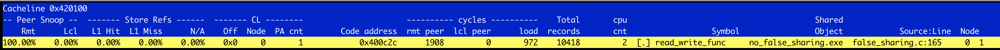

# 倚天710性能监控 —— 如何使用perf arm-SPE检测cacheline竞争

## REVISION HISTORY

| DATE      | VERSION | DESCRIPTION     | AUTHOR     | APPROVER               |
| --------- | ------- | --------------- | ---------- | ---------------------- |
| 2023/2/26 | 1.0     | Initial version | Jing Zhang | Shuai Xue、Baolin Wang |

## 前言

Statistical Profiling Extension 是 ARMv8.2 中的可选功能。本文将描述它的工作原理及优势。并介绍如何使用SPE特性检测cacheline竞争，以此优化代码，提高程序性能。

## 一、SPE介绍

### 1.1 什么是SPE
SPE（Statistical Profiling Extension）统计分析扩展在 ARMv8.2 中是可选的，并且仅在 AArch64 执行状态下支持。在指令或微操作的基础上设置采样标准，然后以一定的时间间隔进行采样。每个样本都会收集与该样本相关的上下文，形成一个剖析记录，在任何时候都只有一个记录被编译。当在长时间运行大型工作负载的系统上连续采样时，分析大型工作集的样本可以提供对软件执行及其相关性能的相当深入的了解。 SPE 提供了执行指令的性能特征的统计视图，软件编写者可以使用它来优化他们的代码以获得更好的性能。
SPE（统计分析扩展）功能可将延迟和事件准确归因于**单个指令**。 它不是由中断驱动，而是选择一条指令进行**采样**，然后在执行期间为其捕获数据，数据包括周期执行时间。 对于加载和存储，它还包括数据地址、缓存未命中事件和数据来源。
到目前为止，内核或 Perf 都没有对 SPE 数据进行解码。 只有当使用“perf report”或“perf script”打开录制的文件时，才会进行解码。 解码数据时，Perf 会生成“synthetic samples”，就好像这些是在record时生成的一样。 这些样本与 Perf 在不使用 SPE 的情况下进行的采样相同，但它们可具有更多属性。 例如，普通样本可能只有指令指针，但 SPE 样本可以有数据地址和延迟属性。

### 1.2 SPE为什么是采样
采样，而不是跟踪，以减少硬件对分析问题的开销。 一次只有一个采样操作正在运行，当record将缓冲区填满后，才发起中断，减少了中断的发起，同时SPE减少了滑动偏差。 允许更精确的数据源，包括：完整的 PC 指令、数据虚拟和物理地址。
允许指令和事件之间的关联，例如 TLB 和缓存未命中。 （数据源表示命中了哪个特定的缓存，但含义是在实现定义的，因为不同的实现可以有不同的缓存配置。）
但是，SPE 不提供任何调用图信息，并且依赖于统计方法。
### 1.3 SPE采样步骤
**1、选择一个指令**
定义样本总体，它可以都是架构指令或者都是微指令，可在实现中定义。采样以可编程的时间间隔进行。 该体系结构为 SPE 驱动程序提供了一种机制来推断它应该采样的最小间隔。 如果未指定间隔，则驱动程序将使用此最小间隔。 默认情况下，还会在采样间隔中添加伪随机扰动。
**2、采集关于这个指令的数据**
SPE记录与操作相关的程序计数器、PMU 事件、时序和数据地址。 同时在采样时确保只有一个采样操作在进行中。在操作被解码后，间隔计数器开始递减，当计数器达到零时，将选择一个操作进行分析并在处理器流水线中进行跟踪，并捕获有关操作的信息。操作完成后，此信息将形成样本记录。 
**3、过滤一部分采集记录，并写入内存**
然后可以根据某些可编程标准过滤样本记录。如果样本满足过滤器，则将其写入内存缓冲区。否则记录被丢弃。
**4、当缓冲区填满后，触发中断**
当缓冲区填满时，会发送一个中断，驱动程序会向 Perf 发出信号以收集记录。 Perf 将原始数据保存在 perf.data 文件中。
### 1.4 采样冲突
当一个操作被采样而前一个采样操作还没有完成时，就会发生冲突，新样本被丢弃。 冲突会影响数据的完整性，因此应设置采样率以避免碰撞。
'sample_collision' PMU 事件可以确定丢失样本的数量。 但这个计数是基于冲突_before_过滤发生， 因此，这不能作为通过过滤器丢弃的样本的确切数字，但可以作为粗略的参考。
### 1.5 SPE的优势
在不采用SPE时，也可以使用基于事件的采样，步骤为：对性能计数器进行编程以计算感兴趣的事件；将计数器设置为负数；将计数器配置为在计数器回零时产生中断；中断发生时对程序行为进行采样。
然而，这存在打滑和盲点的问题。计数器为事件递增、产生中断并接受中断需要时间，在此期间处理器已经从产生事件的指令前进。对于高性能处理器来说，这个skid可能是数百条处理器指令，这意味着数据并没有工程师想要的那么有用。此外，如果此时屏蔽了中断，则在取消屏蔽之前无法获取中断，从而产生盲点。基于事件的采样可以粗略地确定事件发生的位置，但不能准确地确定事件发生的位置。
在x86中，是通过PEBS特性来解决以上问题，而在arm中，即采用SPE特性，PEBS和SPE的原理是相似的。SPE（统计分析扩展）功能可将延迟和事件准确归因于单个指令。 它不是由中断驱动，而是选择一条指令进行采样，然后在执行期间为其捕获数据，再通过硬件将数据写入缓冲区，当缓冲区填满后，再通过中断报告perf，将数据保存到perf.data文件中，因此SPE采样的数据更加精确。 对于load和store指令，它还包括数据地址和数据来源等信息，可以帮助我们定位cacheline竞争。
### 1.6 SPE数据记录格式
SPE采集的原始数据如下图，一个record表示对一个操作（指令）的追踪记录，一个record包含多个packets，不同的packets代表了不同的信息，分别有：Address(PC)、Counter(LAT)、Events(EV)、Type(LD)、Timestamp(TS)、data_source、context等等。更多描述可以参考SPE手册。根据这些packets信息，我们可以对程序进行具体的分析，以帮助我们优化性能。


## 二、使用perf arm-spe特性检测cacheline竞争
Perf c2c工具可以观察缓存行的争用，并允许我们识别代码中引发这些缓存活动的位置，因此，该工具可以帮助开发人员优化数据结构（例如使用每个 CPU 数据，或使用“对齐”属性与编译器）以避免错误共享等问题。我们无法仅在软件中检测到错误共享问题，这就是 perf c2c 依赖底层硬件机制来检查缓存活动的原因。在 ARM架构中，perf c2c工具依赖的底层硬件机制是SPE。
那么SPE是如何帮助分析cacheline竞争的呢？上一节描述了SPE采集的record中具有多个的packets，其中data_source packet可以帮助检测缓存行竞争，但其仅仅在neoverse cores系列中支持（例如倚天），SPE采集的data_source packet描述了几种数据来源情况：Peer core (0b1001), Local cluster (0b1010), Peer cluster (0b1100) and Remote (0b1101)等，分别表示读取的数据来源于对等的core，本地cluster，对等的cluster和跨socket的远程访问，将这些事件都归于peer snoop。对data_source packet进行解析时，将数据源“Peer core”、“Local cluster”、“Peer cluster”视为本地peer snoop访问，将“Remote”视为远程peer snoop访问，其中远程peer snoop访问可以对分析跨NUMA情况有所帮助。


### 2.1检测伪共享（false_sharing）
内存操作常常会引入性能瓶颈。在非统一内存访问 (NUMA) 环境中，一个典型的情况是在多个线程并发修改一个缓存行中的多个变量时，由于只能同时有一个线程去操作缓存行，将会导致性能的下降，我们称之为“false_sharing”。在这种情况下，缓存一致性操作代价高昂，并导致显着的性能损失。
1）使用方法：
perf c2c record  [program]
perf c2c report 
2)举个例子：

```c
perf c2c record false_sharing 2
perf c2c report
perf c2c report -c pid,iaddr  //查看发生cacheline竞争对应的代码的Pid信息
```

- **Peer snoop** 字段描述的是这个cacheline发生peer_snoop占总的peer_snoop的百分比。第一条Peer Snoop占比75.42%为Total Load Peer / all Total Load peer, 即801 / (801 + 261) * 100 = 75.42%。
- **Total Load Peer** 表示Load指令发生Peer cacheline访问的次数。如果Total Load Peer数值越低，发生cacheline移动的情况越少，因此不能单从Peer Snoop的百分比大小判断。
- **Local Load Peer** 表示从本地cluster，对等cluster，以及对等CPU 等获取data的次数。
- **Remote Load Peer** 表示从Remote，也就是跨 Die (跨 Socket )获取data的次数。


对上述第一个条目按d键查看详细信息。可以看到cacheline addr: 0x420100对应的详细信息，包括Code address，pid等。

- **cycles** - rmt peer, lcl peer, load (Display with peer type) 

- sum of cycles for given accesses - Remote/Local peer load and generic load

- **Pid**

- pid of the process responsible for the accesses

- **cpu cnt**

      - number of cpus that participated on the access

注意：在内核开启CONFIG_PID_IN_CONTEXTIDR配置选项后，采集的PID更为准确。

对伪共享情况进行优化后，可以看到Total Load Peer的次数下降了，cacheline addr: 0x420140的发生cacheline的情况已消失。



### 2.2检测跨NUMA（跨Die）情况
在倚天平台上，利用SPE特性检测sysbench的“thread”在满核情况下，分析跨NUMA情况，举个例子：
```
perf c2c record sysbench --test=threads --num-threads=128 --thread-locks=1 --time=5 run
perf c2c report
```
得到下图的结果，我们可以看到，基地址0xffff80001c150d40这个缓存行发生较严重的peer snoop事件，其中，Load指令Remote Peer（2001）/Local Peer（2590）比值相对较高，选中该行，再按键盘“d”，获取更详细的信息，我们可以发现是地址0xffff800010148504代码引发了大量的Remote peer访问，其对应了native_queued_spin_lock_slowpath这个函数，并标记了qspinlock.c文件的第542行代码。


我们可以根据0xffff800010148504地址进行反汇编得到对应的代码，也可以直接根据Symbol和Source：Line找到对应的代码，即qspinlock.c文件的第542行代码，查看代码，可以发现是自旋锁在慢速路径中不断自旋读取锁的状态，从而引发的大量缓存行移动。


对自旋锁进行优化，例如，开启numa aware spinlock (CNA) 特性，让锁尽量交给同一NUMA节点的CPU，以减少跨NUMA情况。然后再次使用perf c2c工具查看程序cacheline情况。从下图可以看到，Remote peer（860）/Local peer（5278）比值明显下降了，d键查看详细信息，可以发现qspinlock.c文件的第542行代码引起的Remote Peer Snoop百分比也是下降了。程序运行的整体性能从而得到了提升。


## 三、SPE更多使用方法
首先，检查内核是否支持SPE：
```c
ls /sys/bus/event_source/devices/ | grep arm_spe_0
arm_spe_0
```
然后，查看驱动支持的SPE事件：
```c
ls /sys/bus/event_source/devices/arm_spe_0/format/
branch_filter  event_filter  jitter  load_filter  min_latency  pa_enable  pct_enable  store_filter  ts_enable
```
使用SPE对程序进行分析：
```c
perf record -e arm_spe// -- sleep 1
```
采样周期是从 -c 选项设置的，因为默认使用最小间隔，所以建议将其设置为更高的值。 该值被写入 PMSIRR.INTERVAL。
### 配置参数
配置参数被放置在事件中的 // 之间，并以逗号分隔。 例如'-e arm_spe/load_filter=1,min_latency=10/'

| 配置参数 | 描述 |  |
| --- | --- | --- |
| branch_filter=1 | collect branches only (PMSFCR.B) |  |
| event_filter=<mask>  | filter on specific events (PMSEVFR) - see bitfield description below |  |
| jitter=1	 | use jitter to avoid resonance when sampling (PMSIRR.RND) |  |
| load_filter=1  | collect loads only (PMSFCR.LD) |  |
| min_latency=<n> | collect only samples with this latency or higher* (PMSLATFR) |  |
| pa_enable=1 | collect physical address (as well as VA) of loads/stores (PMSCR.PA) - requires privilege |  |
| pct_enable=1 	 | collect physical timestamp instead of virtual timestamp (PMSCR.PCT) - requires privilege |  |
| store_filter=1 | collect stores only (PMSFCR.ST) |  |
| ts_enable=1 | enable timestamping with value of generic timer (PMSCR.TS) |  |

对于参数min_latency=<n>:
延迟是从该指令开始采样点的总延迟，而不仅仅是执行延迟。
对于参数event_filter=<mask>:
当前只有部分事件可以过滤，包括：

| mask | 描述 |
| --- | --- |
| bit 1 | instruction retired (i.e. omit speculative instructions) |
| bit 3 | L1D refill |
| bit 5 | TLB refill |
| bit 7 | mispredict |
| bit 11 | misaligned access |

因此，如果只需要采样retired的指令：
```c
perf record -e arm_spe/event_filter=2/ -- sleep 1
```
或者，只采样错误预测的分支事件：
```c
perf record -e arm_spe/event_filter=0x80/ -- sleep 1
```
## 参考资料

[1] [https://community.arm.com/arm-community-blogs/b/architectures-and-processors-blog/posts/statistical-profiling-extension-for-armv8-a](https://community.arm.com/arm-community-blogs/b/architectures-and-processors-blog/posts/statistical-profiling-extension-for-armv8-a?spm=ata.21736010.0.0.9f427fb39B6BwI)

[2] https://developer.arm.com/documentation/102099/0000/Statistical-Profiling-Extension-support/Statistical-Profiling-Extension-events-packet

[3] https://developer.arm.com/documentation/102099/0000/Statistical-Profiling-Extension-support/Statistical-Profiling-Extension-data-source-packet

[4] https://www.linaro.org/blog/using-the-arm-statistical-profiling-extension-to-detect-false-cache-line-sharing/

[5] Arm® Architecture Reference Manual Chapter D9 The Statistical Profiling Extension
