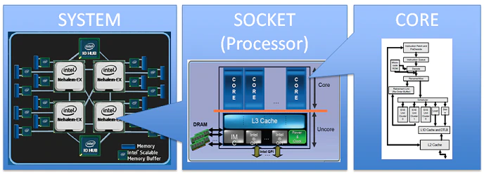
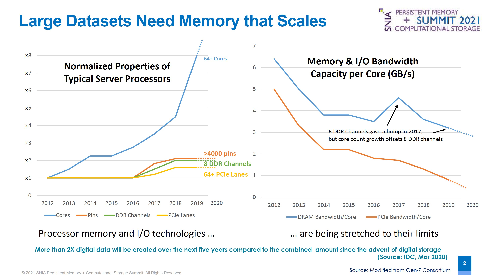
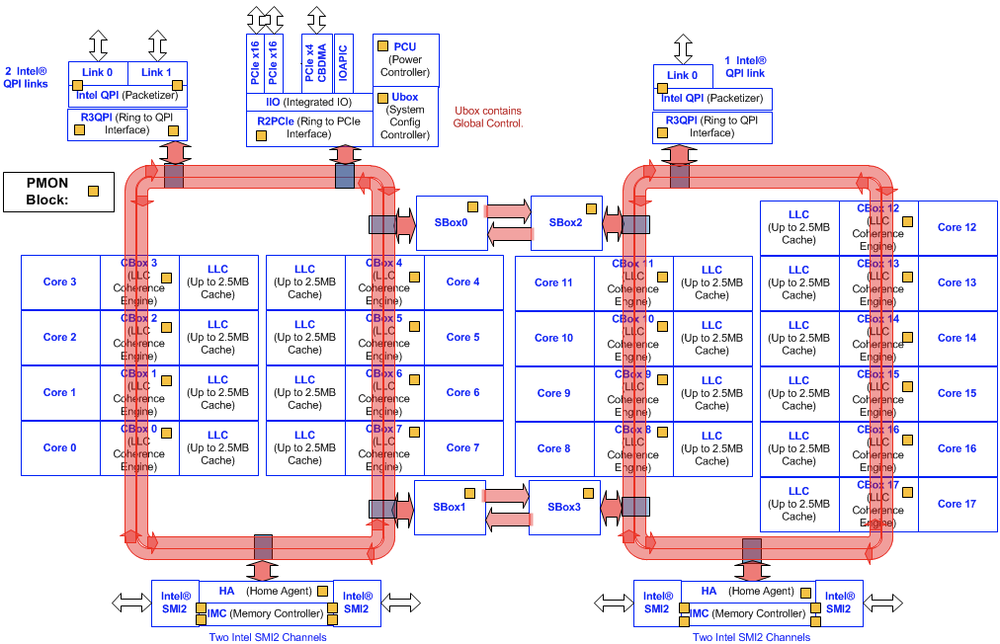
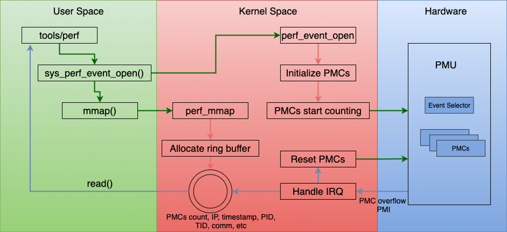

# 倚天710性能监控 —— 导读

## REVISION HISTORY

| DATE      | VERSION | DESCRIPTION     | AUTHOR    | APPROVER    |
| --------- | ------- | --------------- | --------- | ----------- |
| 2023/2/26 | 1.0     | Initial version | Shuai Xue | Baolin Wang |

## 一、系统的性能监控

在过去的几十年里，计算系统的复杂性大大增加。分层缓存子系统（Hierarchical cache subsystems）、非统一内存（non-uniform memory）、同步多线程（simultaneous multithreading）、乱序执行（out-of-order execution）、推测执行（speculative execution）等对现代处理器的性能和计算能力有着巨大的影响。

CPU利用率是操作系统常用的一个指标，已用于任务调度、容量规划等许多场景。与现代处理器相比，通过统计单核处理器上负载的执行时间和空闲时间，可以很好的反应CPU的剩余算力。因此，对于计算密集型任务，CPU利用率可靠的作为调度指标。多核和多CPU系统、多级缓存、非统一内存、多线程（SMT）、流水线、乱序执行、推测执行等计算机体系结构的进步，使CPU利用率成为一个不可靠的指标。

一个典型的例子是，使用Intel超线程（Hyper-Threading)技术的处理器，其CPU利用率是非线性的。采用超线程技术，CPU的性能最高可以提高30%，带来的问题是，CPU不能客观反应其剩余算力。例如，一个任务在每个物理核上运行一个线程，每个CPU利用率为50%，但其实任务最多可以使用70%-100%的执行单元。

另外，处理器的时钟频率和性能以超乎想象的速度增长；但是主存的访问速度（主要是DRAM）的增长却要缓慢的多；虽然Cache和预取能够对减少平均访存时间有所帮助，但仍然不能从根本上解决问题，由通信带宽和延迟构成的“存储墙（Memory wall）”成为提高系统性能的最大障碍。如下图，左半边显示从2012-2019年，服务器CPU核心（从8核到64核）增长了8倍，而Pin针脚数量（从LGA-2011到4094/4189）和内存通道数（从4到8）仅增长了2倍，PCIe lane（从40到64，如果是AMD则按照双路中每CPU支持来算）甚至不到2倍，可以看到，I/O跟不上计算密度的增长。因此，对于内存带宽敏感型任务或IO带宽敏感型任务，通常几个物理核就可以打满内存带宽和IO带宽，导致即使有空闲的物理核，任务的性能也无法提高。

## 二、Performance Monitoring Unit

好消息是，X86和ARM的处理器都提供了性能监控单元（Performance Monitoring Unit ，PMU），作为其体系结构的一部分，从芯片层面支持了性能监控（Monitor）和跟踪（Trace）能力。PMU由一组控制寄存器和计数器寄存器（Performance Monitor Counter，PMC）组成，其中控制寄存器用于选择计数器，使能计数，和指定计数器收集的事件。PMU遍布在SoC中的Core和Uncore中，以Intel Xeon E7 v3为例，core、CBox、SBox、PCU、QPI等都包含PMU。

通常，处理器支持以下事件：

- Core事件：instructions retired, elapsed core clock ticks,  L2 cache hits and misses, L3 cache misses and hits (including or excluding snoops).
- Uncore事件：read bytes from memory controller(s), bytes written to memory controller(s), data traffic transferred by the Interconnect links.

## 三、 Perf Subsystem

性能监控意味着收集应用程序或系统执行状态相关的信息，这些信息可以通过基于软件的方式获得，也可以从硬件获得，Perf集成了这两种方法。Perf是 Linux 中的最常用的性能分析工具之一，Linux内核从2009 年的 2.6.31版本就开始支持perf子系统。Perf可以对整个系统（内核和用户代码）进行统计分析，支持hardware performance counters、 tracepoints、software performance counters (e.g. hrtimer)和 dynamic probes (for example, kprobes or uprobes)。

Perf支持以下分析模式[4]

- 计数（Counting）：记录事件发生的次数。
- 基于事件的采样（Event-Based Sampling）：每当发生一定数量的事件时，就记录一个样本。
- 基于时间的采样（Time-Based Sampling）：按固定的频率记录样本。
- 基于指令的采样（Instruction-Based Sampling）：记录采样周期内指令触发的事件。

## 四、倚天710的PMU支持

倚天710采用的是Arm Neoverse N2核心，兼具性能和能效，下图为Arm的N2参考设计：

目前倚天710 SoC中的关键组件都支持PMU的采集，包括：

- Core PMU & SPE
- 总线互联：CMN-700
- 主存DDR控制器：DDR5 Controller
- 外设总线PCIe控制器：PCIe Controller

## 参考文献

[1]. [https://www.intel.com/content/www/us/en/developer/articles/technical/performance-counter-monitor.html#abstracting](https://www.intel.com/content/www/us/en/developer/articles/technical/performance-counter-monitor.html#abstracting)

[2]. [https://www.snia.org/sites/default/files/PM-Summit/2021/snia-pm-cs-summit-Sainio-Future-of-PM-2021-updated.pdf](https://www.snia.org/sites/default/files/PM-Summit/2021/snia-pm-cs-summit-Sainio-Future-of-PM-2021-updated.pdf)

[3]. [https://kib.kiev.ua/x86docs/Intel/PerfMon/331051-002.pdf](https://kib.kiev.ua/x86docs/Intel/PerfMon/331051-002.pdf)

[4]. [https://documentation.suse.com/sles/15-GA/html/SLES-all/cha-perf.html](https://documentation.suse.com/sles/15-GA/html/SLES-all/cha-perf.html)

[5]. [https://community.arm.com/arm-community-blogs/b/architectures-and-processors-blog/posts/arm-neoverse-n2-industry-leading-performance-efficiency](https://community.arm.com/arm-community-blogs/b/architectures-and-processors-blog/posts/arm-neoverse-n2-industry-leading-performance-efficiency)

