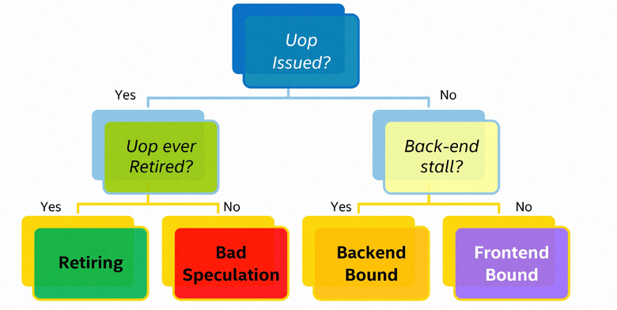

# 倚天710性能监控 —— 自顶向下的CPU架构性能瓶颈分析方法-Topdown

## REVISION HISTORY

| DATE      | VERSION | DESCRIPTION     | AUTHOR     | APPROVER               |
| --------- | ------- | --------------- | ---------- | ---------------------- |
| 2023/2/26 | 1.0     | Initial version | Jing Zhang | Shuai Xue、Baolin Wang |

## 前言

目前的 CPU 越来越复杂，应用了许多方法使得 CPU 跑得越来越快，也使得 CPU 越来越难以被分析。普通的用户、软件开发人员，很少有精力去弄懂整个 CPU 架构，去了解每一个 CPU 模块。若有一种分析方法，可以帮助用户快速了解定位当前应用在 CPU 上的性能瓶颈，用户便可以有针对性地修改自己的程序，以充分利用当前的硬件资源。而 topdown 微体系结构分析方法（TMA，下面均用topdown来表示此方法）是一种经过行业验证的系统方法，可识别乱序内核中的性能瓶颈，识别真正的瓶颈可以让开发人员专注于软件调整来修复它们并在相同的硬件上有效地改进。
Topdown 分析方法起初是 Intel 的一位工程师提出的方法，主要应用在 x86 上，但是我们发现同样可以用在 ARM 和 RISC-V 等架构中，并且对于复杂的 GPU 架构，在一些流水线比较简单的比如机器学习相关的应用中也能进行相应的瓶颈分析。
本文主要介绍在倚天平台上 topdown 的原理和使用。为了更好的理解 topdown 分析方法，首先向大家简单介绍一下 CPU 的 pipeline 机制。

## 一、 Pipeline介绍


上图显示了 倚天710（Neoverse N2 内核）的指令处理流水线。Pipeline 在获取指令并经过简单的解码后，会进入 pipeline 的寄存器 rename 阶段和 dispatch 阶段。这些指令在 dispatch 阶段会进一步拆分为两个微操作 (uops)。完成 dispatch 的微操作 (uops) 将等待被 issue，然后 issue 阶段会将 uops 乱序发送到 13 个执行 pipeline 之一，issue 阶段有多个 issue queue，但是每个执行 pipeline 在一个 cycle 内只可以执行并完成一个 uop。
虽然一些不太复杂的指令（例如，ADD 或 MOV）可能作为单个微操作发出，但其他指令可能会分解为两个微操作。 Arm 没有公布微操作列表。
Pipeline 的 Fetch 和 Decode 阶段只能是顺序执行的，这一部分称为流水线的前端。而 issue 阶段及之后的执行可以是乱序的，issue 阶段之后称为流水线的后端。请注意，指令的 commit 阶段是顺序的，也就是 uops 执行完成之后的提交阶段是顺序的。
倚天710（Neoverse N2 内核) 的 pipeline 可以乱序和推测性执行指令。 如果不同指令之间不存在数据依赖性，则这些不同指令可以推测性地乱序执行并保存它们的结果。 这允许 pipeline 向不同的后端 pipeline 发出指令，以便 pipeline 执行尽可能多的指令。

## 二、Topdown概念

Topdown 是一种快速识别乱序处理器中真正瓶颈的实用方法。Topdown 只能帮助解决 CPU 受限问题。 如果瓶颈在其他地方，则必须使用其他方法。 非 CPU 瓶颈可以是网络、阻塞延迟（例如同步）、磁盘 IO、显卡等。
Topdown 根据 CPU 的 Pipeline 处理流程将性能瓶颈分成了四类：Frontend Bound，Bad Speculation，Retiring，Backend Bound。

### 2.1 Frontend Bound

Frontend 是 Pipeline 的第一部分，包括了获取分支预测器预测的下一个地址、获取缓存行、解析指令、解码 Backend 之后可执行的微操作等步骤。 因此 Frontend Bound 占比大的话，意味着获取指令、解析指令等核心部分是程序的瓶颈所在，也就是 ITLB miss 或 Icache miss 等情况。

### 2.2 Bad Speculation

错误推演反映了由于错误推演而浪费的 slot 资源。 其中包括两部分：1、发射最终不会 retired 的微指令； 2、由于从早期的错误推演中恢复而导致 pipeline 被阻塞。 例如，在错误推演的分支下发射的微指令导致的 slot 资源浪费属于此分类。

### 2.3 Retiring

Ritiring 反映了发射的指令真正被架构执行最后 Retired 的占比，一个理想的程序是 Retiring 的占比为100%。因此 Retiring 占比越高，反映了程序被浪费的资源越少，效率越高。

### 2.4 Backend Bound

Backend 是 pipeline 的后半部分，Frontend Bound 反映了指令被解码成微指令被发射后，在指令执行阶段没有交付到下一阶段的情况，造成 Backend Bound 的情况可能：data-cache miss 或者 Divider 过载导致的阻塞等。Backend bound 可以分为 core bound 和 memory bound。

- core bound

Core Bound 有点棘手。 它的停顿可能表现为较短的执行饥饿期，或次优的执行端口利用率：一个长延迟的除法操作可能会序列化执行，而服务于特定类型微指令的执行端口的压力可能表现为一个周期中使用的端口数量很少。Core Bound 问题通常可以通过更好的代码生成来缓解。 例如，一系列相关算术运算将被归类为 Core Bound。 编译器可以通过更好的指令调度来缓解这种情况。 矢量化也可以缓解 Core Bound 问题。

- memory bound

Memory Bound 对应于与内存子系统相关的执行停顿。 这些停顿通常表现为执行单元在短时间后变得饥饿，就像加载丢失所有缓存的情况一样。


如上图所示，topdown 分析方法可以分成多个层级，第一层级即为上述介绍的四个分类，第二层级会对第一层级的分类做进一步划分，第三层级亦是如此。目前在倚天平台中，只能支持到第一层级，并采用一些额外的手段可以进一步获取了第二层级的部分信息。这将在 topdown 的使用中介绍。

## 三、 Topdown原理

要了解 topdown 的原理，我们先来看一下 pipeline slot 的概念。倚天710（Neoverse N2 内核）的 slot 是 5，slot 数量代表的是硬件的资源。即在理想情况下，前端每个周期可以向后端发送 5 个 uops，后端每个周期也能接收 5 个 uops ，每个周期最多可以提交 5 个 uops。如下图所示，假如要分析的程序经过的周期数为 8，绿色表示 pipeline 被 uop 填充的情况，那么每一个点，便是一个 pipeline slot，总的 pipeline slot 数为40，由于每一个 pipeline slot 都被利用到了，因此这个程序没有发生 stall 的情况。


但是由于某些原因，导致前端不能每个周期发送 5 个 uops，或者后端不能接收 5 个 uops，便会出现某些周期的 pipeline slots 未被 uops 填充的情况。如下图所示，灰色表示该 pipeline slots 并未被 uops 所填充，会被 CPU 上的 PMU 统计为一个 stall_slot。如果是由于前端不能发送指令导致的 stall_slot，又可以归为 stall_slot_frontend，如果是后端不能接收指令导致的 stall_slot，即为 stall_slot_backend。由此可见，stall_slot等于 stall_slot_frontend 与 stall_slot_backend 之和。


我们知道 stall_slot_backend 和 stall_slot_frontend 在整个程序中的计数，而 pipeline slot 的总数为程序运行的总 cycle 数乘 slot 数量，我们可以计算 frontend bound 和 backend bound 的占比。

**Frontend Bound = stall_slot_frontend / (cpu_cycles * slots)**

**Backend Bound = stall_slot_backend / (cpu_cycles * slots)**

对于所有的 CPU 资源，除去被阻塞的占比，剩下的就是 Retiring 和 Bad Speculation 的占比。如下图所示，如果微指令被发射了，但是最终指令没有被提交（retired），将被认为是错误预测的指令，而如果指令被发射后最后也被提交了，这个指令将被 CPU 的 PMU 统计为提交（或退休）指令 op_retired。虽然 PMU 没有统计错误预测的指令数，但是 PMU 统计了所有被发射的指令总数 op_spec，那么错误预测的指令数即为 op_spec 减去 op_retired。因此我们可以统计到 Bad Speculation 和 Retiring 的占比。

**Retiring = (op_retired / op_spec) * (1 - stall_slot / (cpu_cycles * slots))**

**Bad Speculation = (1 - op_retired / op_spec) * (1 - stall_slot / (cpu_cycles * slots))**



在 Arm 的官方文档中，关于 topdown 的公式与我们推导的公式一致，如下图所示。


但是在实际的应用中，通过对比stall_frontend和stall_backend 与 stall_slot_frontend 和stall_slot_backend的值，stall_slot_frontend接近stall_frontend的10倍，stall_slot_backend接近stall_backend的5倍，stall_slot_backend的数据符合slots为5的情况，stall_slot_frontend的数值可能存在异常。经 PTG 专家分析RTL，frontend_slot_stall多统计了cycles，并给出了修正公式。arm也同样确认这一问题，提了[pre-errata](https://developer.arm.com/documentation/SDEN1982442/1200/?lang=en)。在 倚天710（Neoverse N2 内核）中，真实的 stall_slot 和真实的 stall_slot_frontend 需要减去一个 cpu_cycles。

**real stall_slot_frontend = stall_slot_frontend - cyu_cycles**

**real stall_slot = stall_slot - cpu_cycles**

因此校正后的 topdown 公式为：

**Frontend Bound = (stall_slot_frontend - cpu_cycles) / (cpu_cycles * slots)**

**Backend Bound = stall_slot_backend / (cpu_cycles * slots)**

**Retiring = (op_retired / op_spec) * (1 - (stall_slot - cpu_cycles) / (cpu_cycles * slots))**

**Bad Speculation = (1 - op_retired / op_spec) * (1 - (stall_slot -cpu_cycles) / (cpu_cycles * slots))**

## 四、 Topdown使用：perf metric

Topdown 的使用还有一种更简单的办法，就是通过 perf metric。 直接通过 perf 工具获取 topdown 各指标信息，另外还包括了TLB、branch、cache、instructionMix和CPU utilization等指标组信息。当前这项工作也已合入 upstream 社区。
使用效果如下：

```c
#./perf stat -M topdownl1 false_sharing 2
7 mticks, reader_thd (thread 3), on node 1 (cpu 79).
9 mticks, reader_thd (thread 2), on node 0 (cpu 2).
26 mticks, lock_th (thread 1), on node 1 (cpu 78).
26 mticks, lock_th (thread 0), on node 0 (cpu 0).

 Performance counter stats for 'false_sharing 2':

     3,922,334,305      cpu_cycles                       #      0.0 %  bad_speculation
                                                  #      4.4 %  retiring                 (66.65%)
    22,679,591,134      stall_slot                                                              (66.65%)
       854,404,256      op_spec                                                                 (66.65%)
       853,521,883      op_retired                                                              (66.65%)
     3,922,227,771      cpu_cycles                       #     23.3 %  frontend_bound           (66.86%)
     8,492,337,939      stall_slot_frontend                                                     (66.86%)
     3,922,584,678      cpu_cycles                       #     73.0 %  backend_bound            (66.49%)
    14,317,243,430      stall_slot_backend                                                      (66.49%)

       0.546175840 seconds time elapsed

       1.427652000 seconds user
       0.000000000 seconds sys
```

```c
#./perf_metric stat -M tlb false_sharing 2
7 mticks, reader_thd (thread 3), on node 1 (cpu 78).
10 mticks, reader_thd (thread 2), on node 0 (cpu 2).
22 mticks, lock_th (thread 0), on node 0 (cpu 0).
23 mticks, lock_th (thread 1), on node 1 (cpu 77).

 Performance counter stats for 'false_sharing 2':

            24,682      L2D_TLB                          #     14.2 %  l2_tlb_miss_rate         (42.26%)
             3,506      L2D_TLB_REFILL                                                          (42.26%)
               844      L1I_TLB_REFILL                   #      0.1 %  l1i_tlb_miss_rate        (42.98%)
         1,647,782      L1I_TLB                                                                 (42.98%)
       324,789,500      L1D_TLB                          #      0.0 %  l1d_tlb_miss_rate        (43.61%)
            21,142      L1D_TLB_REFILL                                                          (43.61%)
           601,629      L1I_TLB                          #      0.0 %  itlb_walk_rate           (43.58%)
                89      ITLB_WALK                                                               (43.58%)
       833,587,916      INST_RETIRED                     #      0.0 MPKI  itlb_mpki             (43.10%)
                 6      ITLB_WALK                                                               (43.10%)
               275      DTLB_WALK                        #      0.0 %  dtlb_walk_rate           (42.54%)
       267,382,086      L1D_TLB                                                                 (42.54%)
       769,673,871      INST_RETIRED                     #      0.0 MPKI  dtlb_mpki             (41.92%)
               176      DTLB_WALK                                                               (41.92%)

       0.464047320 seconds time elapsed

       1.267958000 seconds user
       0.003999000 seconds sys
```

```c
#./perf_metric stat -M cache false_sharing 2
9 mticks, reader_thd (thread 3), on node 1 (cpu 78).
11 mticks, reader_thd (thread 2), on node 0 (cpu 2).
28 mticks, lock_th (thread 1), on node 1 (cpu 77).
28 mticks, lock_th (thread 0), on node 0 (cpu 0).

 Performance counter stats for 'false_sharing 2':

     1,107,780,139      INST_RETIRED                     #      6.7 MPKI  ll_cache_read_mpki    (29.42%)
         7,392,505      LL_CACHE_MISS_RD                                                        (29.42%)
         7,397,206      LL_CACHE_MISS_RD                                                                                              (30.45%)
                 0      LL_CACHE_RD                                                             (30.45%)
     1,102,339,626      INST_RETIRED                     #      6.6 MPKI  l3d_cache_mpki        (31.46%)
         7,298,601      L3D_CACHE_REFILL                                                        (31.46%)
                 0      L3D_CACHE                                                               (31.21%)
         7,114,118      L3D_CACHE_REFILL                                                        (31.21%)
       841,891,447      INST_RETIRED                     #      8.5 MPKI  l2d_cache_mpki        (30.70%)
         7,143,534      L2D_CACHE_REFILL                                                        (30.70%)
         7,145,383      L2D_CACHE_REFILL                 #     47.8 %  l2d_cache_miss_rate      (30.06%)
        14,962,069      L2D_CACHE                                                               (30.06%)
       823,053,776      INST_RETIRED                     #      0.0 MPKI  l1i_cache_mpki        (29.80%)
            17,031      L1I_CACHE_REFILL                                                        (29.80%)
       141,880,099      L1I_CACHE                        #      0.0 %  l1i_cache_miss_rate      (29.30%)
            24,629      L1I_CACHE_REFILL                                                        (29.30%)
       784,595,695      INST_RETIRED                     #      9.0 MPKI  l1d_cache_mpki        (28.93%)
         7,035,459      L1D_CACHE_REFILL                                                        (28.93%)
         7,220,296      L1D_CACHE_REFILL                 #      2.7 %  l1d_cache_miss_rate      (28.67%)
       268,178,900      L1D_CACHE                                                               (28.67%)

       0.572091677 seconds time elapsed

       1.549906000 seconds user
       0.000000000 seconds sys
```

```c
#./perf_metric stat -M branch false_sharing 2
8 mticks, reader_thd (thread 3), on node 1 (cpu 78).
10 mticks, reader_thd (thread 2), on node 0 (cpu 2).
21 mticks, lock_th (thread 0), on node 0 (cpu 0).
22 mticks, lock_th (thread 1), on node 1 (cpu 77).

 Performance counter stats for 'false_sharing 2':

       903,690,694      INST_RETIRED                     #    181.5 PKI  branch_pki
       164,002,095      BR_RETIRED
       903,690,694      INST_RETIRED                     #      0.0 MPKI  branch_mpki
            14,179      BR_MIS_PRED_RETIRED
            14,179      BR_MIS_PRED_RETIRED              #      0.0 %  branch_miss_pred_rate
       164,002,095      BR_RETIRED

       0.451503596 seconds time elapsed

       1.255690000 seconds user
       0.000000000 seconds sys
```

```c
#./perf_metric stat -M instructionmix false_sharing 2
8 mticks, reader_thd (thread 3), on node 1 (cpu 78).
9 mticks, reader_thd (thread 2), on node 0 (cpu 2).
22 mticks, lock_th (thread 0), on node 0 (cpu 0).
23 mticks, lock_th (thread 1), on node 1 (cpu 77).

 Performance counter stats for 'false_sharing 2':

     1,133,344,181      INST_SPEC                        #      7.1 %  store_spec_rate          (32.52%)
        80,337,890      ST_SPEC                                                                 (32.52%)
     1,104,052,031      INST_SPEC                        #     23.3 %  load_spec_rate           (33.14%)
       257,618,259      LD_SPEC                                                                 (33.14%)
     1,067,206,099      INST_SPEC                        #      0.0 %  float_point_spec_rate    (34.06%)
                 0      VFP_SPEC                                                                (34.06%)
       400,697,153      DP_SPEC                          #     49.9 %  data_process_spec_rate   (34.12%)
       803,044,283      INST_SPEC                                                               (34.12%)
       799,727,535      INST_SPEC                        #      0.0 %  crypto_spec_rate         (33.97%)
                 0      CRYPTO_SPEC                                                             (33.97%)
       791,995,726      INST_SPEC                        #      1.2 %  branch_return_spec_rate  (33.66%)
         9,668,335      BR_RETURN_SPEC                                                          (33.66%)
       785,639,253      INST_SPEC                        #      1.2 %  branch_indirect_spec_rate  (33.36%)
         9,790,638      BR_INDIRECT_SPEC                                                        (33.36%)
       812,129,447      INST_SPEC                        #     16.6 %  branch_immed_spec_rate   (32.89%)
       134,980,184      BR_IMMED_SPEC                                                           (32.89%)
               257      ASE_SPEC                         #      0.0 %  advanced_simd_spec_rate  (32.27%)
       850,628,196      INST_SPEC                                                               (32.27%)

       0.471328246 seconds time elapsed

       1.301725000 seconds user
       0.000000000 seconds sys
```

```c
#./perf_metric stat -M peutilization false_sharing 2
6 mticks, reader_thd (thread 3), on node 1 (cpu 78).
9 mticks, reader_thd (thread 2), on node 0 (cpu 2).
30 mticks, lock_th (thread 0), on node 0 (cpu 0).
31 mticks, lock_th (thread 1), on node 1 (cpu 77).

 Performance counter stats for 'false_sharing 2':

       897,944,245      OP_SPEC                          #     99.9 %  retired_rate
                                                  #      0.1 %  wasted_rate
                                                  #      4.1 %  cpu_utilization          (49.86%)
    25,172,908,122      STALL_SLOT                                                              (49.86%)
     4,345,143,906      CPU_CYCLES                                                              (49.86%)
       897,093,238      OP_RETIRED                                                              (49.86%)
       979,724,144      INST_SPEC                        #     0.23 spec_ipc                    (50.14%)
     4,345,127,383      CPU_CYCLES                                                              (50.14%)
       818,118,263      INST_RETIRED                     #     0.19 retired_ipc                 (50.14%)
     4,345,401,504      CPU_CYCLES                                                              (50.14%)
       825,436,139      instructions
                                                  #     0.19 ipc
                                                  #      3.8 %  ipc_rate                 (74.95%)
     4,345,430,048      CPU_CYCLES                                                              (74.95%)

       0.623730618 seconds time elapsed

       1.581404000 seconds user
       0.000000000 seconds sys
```

## 参考资料

[1] [https://zhuanlan.zhihu.com/p/60940902](https://zhuanlan.zhihu.com/p/60940902)

[2] [https://documentation-service.arm.com/static/62cfe21e31ea212bb6627393?token=](https://documentation-service.arm.com/static/62cfe21e31ea212bb6627393?token=)

[3] [https://documentation-service.arm.com/static/60250c7395978b529036da86?token=](https://documentation-service.arm.com/static/60250c7395978b529036da86?token=)

[4] [https://documentation-service.arm.com/static/636a66a64e6cf12278ad89cb?token=](https://documentation-service.arm.com/static/636a66a64e6cf12278ad89cb?token=)

[5] [https://documentation-service.arm.com/static/628f8fa3dfaf015c2b76eae8?token=](https://documentation-service.arm.com/static/628f8fa3dfaf015c2b76eae8?token=)

[6] [https://developer.arm.com/documentation/SDEN1982442/1200/?lang=en](https://developer.arm.com/documentation/SDEN1982442/1200/?lang=en)

